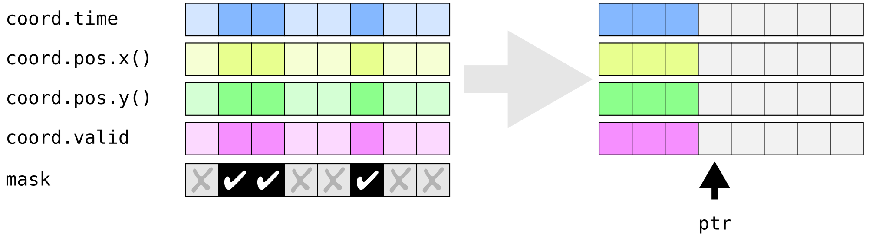
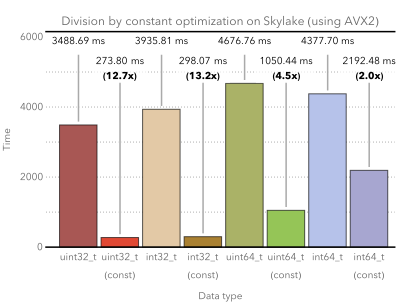
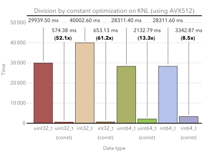

Advanced topics
===============

This section is still under construction.

TODO: Python integration. ENOKI_UNLIKELY, meshgrid,
memory allocator, low(), high(), head<>(), copysign,
mulsign, concat, function calls,
stl.h

dynamic array class & set_slices, slices, packet, slice

- broadcasting
- arithmetic involving arrays of references

Undocumented: reinterpret_array, shuffle

.. _compression:

Compressing arrays
------------------

A common design pattern in vectorized code involves *compressing* arrays, i.e.
selectively writing only masked parts of an array so that the selected entries
become densely packed in memory (e.g. to improve resource usage when only parts
of an array participate in a computation).

The function :cpp:func:`enoki::compress` efficiently maps this operation onto
the targeted hardware (SSE4.2, AVX2, and AVX512 implementations are provided).
The function also automatically advances the pointer by the amount of written
entries.

.. code-block:: cpp

    Array<float, 16> input = ...;
    auto mask = input < 0;

    float output[16];
    size_t count = compress(output, input, mask);
    std::cout << count << " entries were written." << std::endl;
    ...

Custom data structures such as the GPS record class discussed in previous
chapters are transparently supported by :cpp:func:`enoki::compress`---in this
case, the mask applies to each vertical slice through the data structure as
illustrated in the following figure:

The :cpp:func:`slice_ptr` function is used to acquire a pointer to the
beginning of the output array. It returns a value of type ``GPSRecord2<float
*>``, which is composed of multiple pointers (one for each component). The
following snippet illustrates how an arbitrarily long list of records can be
decodeed:

.. code-block:: cpp

    GPSCoord2fX input = /* .. input data to be compressed .. */;

    /* Make sure there is enough space to store all data */
    GPSCoord2fX output;
    set_slices(output, slices(input));

    /* Structure composed of pointers to the output arrays */
    GPSRecord2<float *> ptr = slice_ptr(output, 0);

    /* Counter used to keep track of the number of collected elements */
    size_t final_size = 0;

    /* Go through all packets, compress, and append */
    for (size_t i = 0; i < packets(input); ++i) {
        /* Let's decode out the records with input.reliable == true */
        auto input_p = packet(input, i);
        final_size += compress(ptr, input_p, input_p.reliable);
    }

    /* Now that the final number of slices is known, adjust the output array size */
    set_slices(output, final_size);

.. warning::

    The writes performed by :cpp:func:`enoki::compress` are at the granularity
    of entire packets, which means that some extra scratch space generally
    needs to be allocated at the end of the output array.

    For instance, even if it is known that a compression operation will find
    exactly ``N`` elements, you are required to reserve memory for ``N +
    Packet::Size`` elements to avoid undefined behavior.

    Note that :cpp:func:`enoki::compress` will never require more memory than
    the input array, hence this provides a safe upper bound.

Vectorized method calls
-----------------------

Method calls and virtual method calls are an important building block of modern
object-oriented C++ applications. When vectorization enters the picture, it is
not immediately clear how they should be dealt with. This section introduces
Enoki's method call vectorization support, focusing on a hypothetical
``Sensor`` class that decodes a measurement performed by a sensor.

Suppose that the interface of the ``Sensor`` class originally looks as follows:

.. code-block:: cpp

    class Sensor {
    public:
        /// Decode a measurement based on the sensor's response curve
        virtual float decode(float input) = 0;

        /// Return sensor's serial number
        virtual uint32_t serial_number() = 0;
    };

It is trivial to add a second method that takes vector inputs, like so:

.. code-block:: cpp
    :emphasize-lines: 9

    using FloatP = Array<float, 8>;

    class Sensor {
    public:
        /// Scalar version
        virtual float decode(float input) = 0;

        /// Vector version
        virtual FloatP decode(FloatP input) = 0;

        /// Return sensor's serial number
        virtual uint32_t serial_number() = 0;
    };

This will work fine if there is just a single ``Sensor`` instance. But what if
there are many of them, e.g. when each ``FloatP`` array of measurements also
comes with a ``SensorP`` structure whose entries reference the sensor that
produced the measurement?

.. code-block:: cpp

    class Sensor;
    using SensorP = Array<Sensor *, 8>;

Ideally, we'd still be able to write the following code, but this sort of thing
is clearly not supported by standard C++.

.. code-block:: cpp

    SensorP sensor = ...;
    FloatP data = ...;

    data = sensor->decode(data);

Enoki provides a support layer that can handle such vectorized method calls. It
performs as many method calls as there are unique instances in the ``sensor``
array while using modern vector instruction sets to do so efficiently. A mask
is forwarded to the callee indicating which SIMD lanes are currently active.

To support a vector method calls, the interface of the vectorized ``decode()``
method must be changed to take a mask its as last input. The
``ENOKI_CALL_SUPPORT`` macro below is also required---this generates the Enoki
support layer that intercepts and carries out the function call.

.. code-block:: cpp
    :emphasize-lines: 7, 13, 14, 15, 16

    class Sensor {
    public:
        // Scalar version
        virtual float decode(float input) = 0;

        // Vector version
        virtual FloatP decode(FloatP input, mask_t<SensorP> mask) = 0;

        /// Return sensor's serial number
        virtual uint32_t serial_number() = 0;
    };

    ENOKI_CALL_SUPPORT_BEGIN(SensorP)
    ENOKI_CALL_SUPPORT(decode)
    /// .. potentially other methods ..
    ENOKI_CALL_SUPPORT_END(SensorP)

Here is a hypothetical implementation of the ``Sensor`` interface:

.. code-block:: cpp

    class Sensor1 : Sensor {
    public:
        /// Vector version
        virtual FloatP decode(FloatP input, mask_t<SensorP> active) override {
            /// Keep track of invalid samples
            n_invalid += count(isnan(input) & mask_t<FloatP>(active));

            /// Transform e.g. from log domain
            return log(input);
        }

        /// Return sensor's serial number
        uint32_t serial_number() {
            return 363436u;
        }

        // ...

        size_t n_invalid = 0;
    };

Supporting scalar *getter* functions
************************************

It often makes little sense to add a separate vectorized and masked version of
simple *getter* functions like as ``serial_number()`` in the above example.
Enoki provides a ``ENOKI_CALL_SUPPORT_SCALAR()`` macro for such cases, which
would be used as follows:

.. code-block:: cpp
    :emphasize-lines: 3

    ENOKI_CALL_SUPPORT_BEGIN(SensorP)
    ENOKI_CALL_SUPPORT(decode)
    ENOKI_CALL_SUPPORT_SCALAR(serial_number)
    ENOKI_CALL_SUPPORT_END(SensorP)

Afterwards, it is possible to efficiently acquire all serial numbers in a
packet at once.

.. code-block:: cpp

    using UInt32P = Array<uint32_t, 8>;

    SensorP sensor = ...;
    UInt32P serial = sensor->serial_number();

Vectorized for loops
--------------------

Enoki provides a powerful :cpp:func:`enoki::range` iterator that enables for
loops with index vectors. The following somewhat contrived piece of code
computes :math:`\sum_{i=0}^{1000}i^2` using brute force addition (but with only
:math:`1000/16\approx 63` loop iterations).

.. code-block:: cpp
    :emphasize-lines: 4

    using Index = Array<uint32_t, 16>;

    Index result(0);

    for (auto pair : range<Index>(0, 1000)) {
        Index index = pair.first;
        mask_t<Index> mask = pair.second;

        result += select(
            mask,
            index * index,
            Index(0)
        );
    }

    assert(hsum(result) == 332833500);

The mask is necessary to communicate the fact that the last loop iteration has
several disabled entries.

.. _integer-division:

Vectorized integer division by constants
----------------------------------------

Integer division is a surprisingly expensive operation on current processor
architectures: for instance, the Knight's Landing architecture requires up to a
whopping *108 cycles* (95 cycles on Skylake) to perform a single 64-bit signed
integer division with remainder. The hardware unit implementing the division
cannot accept any new inputs until it is done with the current input (in other
words, it is not *pipelined* in contrast to most other operations).
Given the challenges of efficiently realizing integer division in hardware,
current processors don't even provide an vector instruction to perform multiple
divisions at once.

Although Enoki can't do anything clever to provide an efficient array division
instruction given these constraints, it does provide a highly efficient
division operation for a special case that is often applicable: *dividing by an
integer constant*. The following snippet falls under this special case because
all array entries are divided by the same constant, which is furthermore known
at compile time.

.. code-block:: cpp

    using Int32 = enoki::Array<uint32_t, 8>;

    Int32 div_43(Int32 a) {
        return a / 43;
    }

This generates the following AVX2 assembly code (with comments):

.. code-block:: nasm

    _div_43:
        ; Load magic constant into 'ymm1'
        vpbroadcastd  ymm1, dword ptr [rip + LCPI0_0]

        ; Compute high part of 64 bit multiplication with 'ymm1'
        vpmuludq      ymm2, ymm1, ymm0
        vpsrlq        ymm2, ymm2, 32
        vpsrlq        ymm3, ymm0, 32
        vpmuludq      ymm1, ymm1, ymm3
        vpblendd      ymm1, ymm2, ymm1, 170

        ; Correction & shift
        vpsubd        ymm0, ymm0, ymm1
        vpsrld        ymm0, ymm0, 1
        vpaddd        ymm0, ymm0, ymm1
        vpsrld        ymm0, ymm0, 5
        ret

We've effectively turned the division into a sequence of 2 multiplies, 4
shifts, and 2 additions/subtractions. Needless to say, this is going to be much
faster than sequence of high-latency/low-througput scalar divisions.

In cases where the constant is not known at compile time, a
:cpp:class:`enoki::divisor` instance can be precomputed and efficiently applied
using :cpp:func:`enoki::divisor::operator()`, as shown in the following example:

.. code-block:: cpp

    using Int32 = enoki::Array<uint32_t, 8>;

    void divide(Int32 *a, int32_t b, size_t n) {
        /* Precompute magic constants */
        divisor<int32_t> prec_div = b;

        /* Now apply the precomputed division efficiently */
        for (size_t i = 0; i < n; ++i)
            a[i] = prec_div(a[i]);
    }

The following plots show the speedup compared to scalar division when dividing
16-packets by a compile-time constant. As can be seen, the difference is fairly
significant on consumer processors (up to **13.2x** on Skylake) and *huge* on
the simple cores found on a Xeon Phi (up to **61.2x** on Knight's Landing).

Enoki's implementation of division by constants is based on the excellent
`libdivide <https://github.com/ridiculousfish/libdivide>`_ library.

.. note::

    As can be seen, unsigned divisions are generally cheaper than signed
    division, and 32 bit division is considerably cheaper than 64 bit
    divisions. The reason for this is that a *64 bit high multiplication*
    instruction required by the algorithm does not exist and must be emulated.

Reinterpreting the contents of arrays
-------------------------------------

In additions to casts between different types, it is possible to reinterpret
the bit-level representation as a different type when both source and target
types have matching sizes and layouts:

.. code-block:: cpp

    using Source = Array<int64_t, 32>;
    using Target = Array<double, 32>;

    Source source = /* ... integer vector which makes sense when interpreted as a double value ... */;
    Target target = reinterpret_array<Target>(source);

This feature can also be used to convert between mask types.

.. _platform-differences:

Architectural differences handled by Enoki
------------------------------------------

Note that the AVX512 back-end is special and instead uses eight dedicated mask
registers to store masks compactly (allocating only a single bit per mask
entry). Such tedious differences between platforms are invisible in user code
that uses the abstractions of Enoki.

for instance, machines with AVX (but no AVX2)
don't have an 8-wide integer vector unit. This means that an ``Array<float,
8>`` can be represented using a single AVX ``ymm`` register, but casting it to
an ``Array<int32_t, 8>`` entails switching to a pair of half width SSE4.2
``xmm`` integer registers, etc.

---for instance, AVX512 uses special mask
registers, while older Intel machines use normal vector registers that have all
bits set to ``1`` for entries where the comparison was true and ``0``
elsewhere. Such tedious platform differences are hidden when using the
abstractions of Enoki.

- Enoki provides control over the rounding mode of elementary arithmetic
  operations. The AVX512 back-end can translate this into particularly
  efficient instruction sequences with embedded rounding flags.

The histogram problem and conflict detection
--------------------------------------------

Consider vectorizing a function that increments the entries of a histogram
given a SIMD vector with histogram bin indices. It is impossible to do this
kind of indirect update using a normal pair of gather and scatter operations,
since incorrect updates occur whenever the ``indices`` array contains an index
multiple times:

.. code-block:: cpp

    using Float = Array<float, 16>;
    using Index = Array<int32_t, 16>;

    float hist[1000] = { 0.f }; /* Histogram entries */

    Index indices = /* .. bin indices whose value should be increased .. */;

    /* Ooops, don't do this. Some entries may have to be incremented multiple time.. */
    scatter(hist, gather<Float>(hist, indices) + 1, indices);

Enoki provides a function named :cpp:func:`enoki::transform`, which modifies an
indirect memory location in a way that is not susceptible to conflicts. The
function takes an arbitrary function as parameter and applies it to the
specified memory location, which allows this approach to generalize to
situations other than just building histograms.

.. code-block:: cpp

    /* Unmasked version */
    transform<Float>(hist, indices,  { return x + 1; });

    /* Masked version */
    transform<Float>(hist, indices,  { return x + 1; }, mask);

Internally, :cpp:func:`enoki::transform` detects and processes conflicts using
the AVX512CDI instruction set. When conflicts are present, the function
provided as an argument may be applied multiple times in a row. When AVX512CDI
is not available, a (slower) scalar fallback implementation is used.

.. _custom-arrays:

Defining custom array types
---------------------------

Enoki provides a mechanism for declaring custom array types using the
`Curiously recurring template pattern
<https://en.wikipedia.org/wiki/Curiously_recurring_template_pattern>`_. The
following snippet shows a declaration of a hypothetical type named ``Spectrum``
representing a discretized color spectrum. ``Spectrum`` behaves the same way as
:cpp:class:`Array` and supports all regular Enoki operations.

.. code-block:: cpp

    template <typename Type, size_t Size>
    struct Spectrum : enoki::StaticArrayImpl<Type, Size, false,
                                            RoundingMode::Default,
                                            Spectrum<Type, Size>> {

        /// Base class
        using Base = enoki::StaticArrayImpl<Type, Size, false,
                                            RoundingMode::Default,
                                            Spectrum<Type, Size>>;

        /// Import constructors, assignment operators, etc.
        ENOKI_DECLARE_CUSTOM_ARRAY(Base, Spectrum)

        /// Helper alias used to transition between vector types (used by enoki::vectorize)
        template <typename T> using ReplaceType = Spectrum<T, Size>;
    };

The main reason for declaring custom arrays is to tag (and preserve)
the type of arrays within expressions. For instance, the type of ``value2``
in the following snippet is ``Spectrum<float, 8>``.

.. code-block:: cpp

    Spectrum<float, 8> value = { ... };
    auto value2 = exp(-value);

Adding backends for new instruction sets
----------------------------------------

Adding a new Enoki array type involves creating a new partial overload of the
``StaticArrayImpl<>`` template that derives from ``StaticArrayBase``. To
support the full feature set of Enoki, overloads must provide at least a set of
core methods shown below. The underscores in the function names indicate that
this is considered non-public API that should only be accessed indirectly via
the routing templates in ``enoki/enoki_router.h``.

* The following core operations must be provided by every implementation.

  * Loads and stores: ``store_``, ``store_unaligned_``, ``load_``,
    ``load_unaligned_``.

  * Arithmetic and bit-level operations: ``add_``, ``sub_``, ``mul_``, ``mulhi_``
    (signed/unsigned high integer multiplication), ``div_``, ``and_``, ``or_``,
    ``xor_``.

  * Unary operators: ``neg_``, ``not_``.

  * Comparison operators that produce masks: ``ge_``, ``gt_``, ``lt_``, ``le_``,
    ``eq_``, ``neq_``.

  * Other elementary operations: ``abs_``, ``ceil_``, ``floor_``, ``max_``,
    ``min_``, ``round_``, ``sqrt_``.

  * Shift operations for integers: ``sl_``, ``sli_``, ``slv_``, ``sr_``, ``sri_``,
    ``srv_``.

  * Horizontal operations: ``none_``, ``all_``, ``any_``, ``hprod_``, ``hsum_``,
    ``hmax_``, ``hmin_``, ``count_``.

  * Masked blending operation: ``select_``.

  * Access to low and high part (if applicable): ``high_``, ``low_``.

  * Zero-valued array creation: ``zero_``.

* The following operations all have default implementations in Enoki's
  mathematical support library, hence overriding them is optional.

  However, doing so may be worthwile if efficient hardware-level support exists
  on the target platform.

  * Shuffle operation (emulated using scalar operations by default):
    ``shuffle_``.

  * Compressed stores (emulated using scalar operations by default):
    ``store_compress_``.

  * Extracting an element based on a mask (emulated using scalar operations by default):
    ``extract_``.

  * Scatter/gather operations (emulated using scalar operations by default):
    ``scatter_``, ``gather_``.

  * Prefetch operations (no-op by default): ``prefetch_``.

  * Trigonometric and hyperbolic functions: ``sin_``, ``sinh_``, ``sincos_``,
    ``sincosh_``, ``cos_``, ``cosh_``, ``tan_``, ``tanh_``, ``csc_``,
    ``csch_``, ``sec_``, ``sech_``, ``cot_``, ``coth_``, ``asin_``,
    ``asinh_``, ``acos_``, ``acosh_``, ``atan_``, ``atanh_``.

  * Fused multiply-add routines (reduced to ``add_``/``sub_`` and ``mul_`` by
    default): ``fmadd_``, ``fmsub_``, ``fnmadd_``, ``fnmsub_``,
    ``fmaddsub_``, ``fmsubadd_``.

  * Reciprocal and reciprocal square root (reduced to ``div_`` and ``sqrt_``
    by default): ``rcp_``, ``rsqrt_``.

  * Dot product (reduced to ``mul_`` and ``hsum_`` by default): ``dot_``.

  * Exponentials, logarithms, powers, floating point exponent manipulation
    functions: ``log_``, ``exp_``, ``pow_`` ``frexp_``, ``ldexp_``.

  * Error function and its inverse: ``erf_``, ``erfinv_``.

  * Optional bit-level rotation operations (reduced to shifts by default):
    ``rol_``, ``roli_``, ``rolv_``, ``ror_``, ``rori_``, ``rorv_``.
