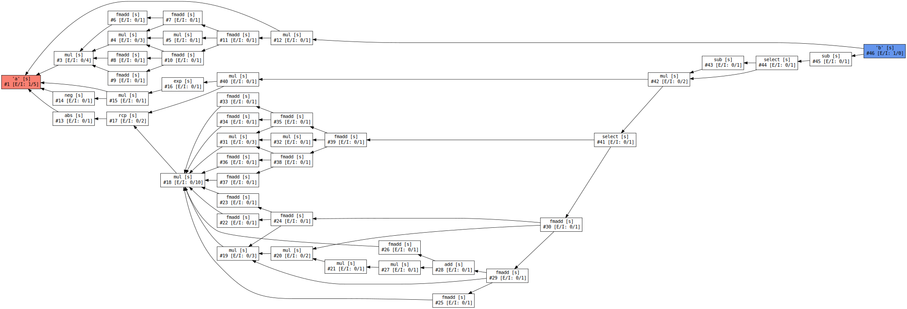
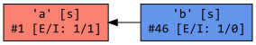
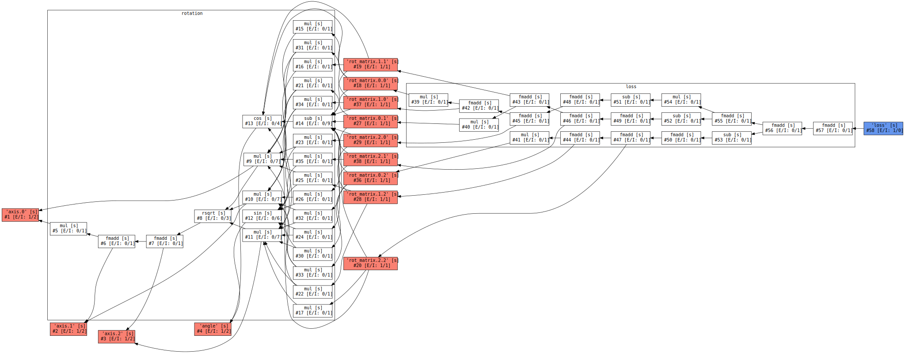

.. cpp:namespace:: enoki
.. _autodiff:

Automatic differentiation
=========================

Automatic differentiation (AD) broadly refers to a set of techniques that
numerically evaluate the gradient of a computer program. Two variants of AD are
widely used:

1. **Forward mode**. Starting with a set of inputs (e.g. ``a`` and ``b``) and
   associated derivatives (``da`` and ``db``), *forward-mode* AD instruments
   every operation (e.g. ``c = a * b``) with an additional step that tracks the
   evolution of derivatives (``dc = a*db + b*da``). Forward mode is ideal for
   functions with a single input and many outputs. When the function has
   multiple inputs, a separate propagation pass is needed per parameter, which
   can become very costly.

2. **Reverse mode**. On the other hand, *reverse-mode* AD specifically targets
   the case where the function to be differentiated has one (or few) outputs
   and potentially many inputs. It traverses the computational graph from
   outputs to inputs, repeatedly evaluating the chain rule in reverse. This
   approach is also known as *backpropagation* in the context of neural
   networks.

   One tricky aspect of reverse-mode is that the backward traversal can only
   begin once the output has been computed. A partial record of intermediate
   computations must furthermore be kept in memory, which can become costly for
   long-running computations.

The implementation in Enoki is realized via the special ``DiffArray<T>`` array
type and supports both of the above variants, though it is particularly
optimized for reverse mode operation. The template argument ``T`` refers to an
arithmetic type (e.g. ``float`` or an Enoki array) that is used to carry out
the underlying primal and derivative computation.

Due to the need to maintain a computation graph for the reverse-mode traversal,
AD tends to involve massive amounts of memory traffic, making it an ideal fit
for GPU-resident arrays that provide a higher amount of memory bandwidth. For
this reason, combinations such as ``DiffArray<CUDAArray<float>>`` should be
considered the default choice. Enoki's Python bindings expose this type as
``FloatD``. As in the previous section, we will stick to the interactive Python
interface and postpone a discussion of the C++ side until the end of this
section.

A ``FloatD`` instance consists of two parts: a floating point array that is
used during the original computation (of type ``FloatC``), and an index that
refers to a node in a separately maintained directed acyclic graph capturing
the structure of the differentiable portion of the computation. By default, the
index is set to zero, which indicates that the variable does not participate in
automatic differentiation.

The following two example snippets demonstrate usage of automatic
differentiation. In both cases, the :cpp:func:`set_requires_gradient` function
is used to mark a variable as being part of a differentiable computation.

.. code-block:: python

    >>> from enoki import *

    >>> # Create a single differentiable variable
    >>> a = FloatD(2.0)
    >>> set_requires_gradient(a)

    >>> # Arithmetic with one input ('a') and multiple outputs ('b', 'c')
    >>> b = a * a
    >>> c = sqrt(a)

    >>> # Forward-propagate gradients from single input to multiple outputs
    >>> forward(a)
    autodiff: forward(): processed 3/5 nodes.

    >>> gradient(b), gradient(c)
    ([4], [0.353553])

The :cpp:func:`forward` and :cpp:func:`backward` function realize the two
previously discussed AD variants, and :cpp:func:`gradient` extracts the
gradient associated with a differentiable variable. An example of reverse-mode
traversal is shown next:

.. code-block:: python

    >>> from enoki import *

    >>> # Create multiple differentiable input variables
    >>> a, b = FloatD(2.0), FloatD(3.0)
    >>> set_requires_gradient(a)
    >>> set_requires_gradient(b)

    >>> # Arithmetic with two inputs ('a', 'b') and a single output ('c')
    >>> c = a * sqrt(b)

    >>> # Backward-propagate gradients from single output to multiple inputs
    >>> backward(c)
    autodiff: backward(): processed 3/4 nodes.

    >>> gradient(a), gradient(b)
    ([1.73205], [0.57735])

Note that :cpp:func:`gradient` returns the gradient using the wrapped arithmetic
type, which is a ``FloatC`` instance in this case. Another function named
:cpp:func:`detach` can be used to extract the value using the underlying
(non-differentiable) array type. Using these two operations, a gradient descent
step on a parameter ``a`` would be realized as follows:

.. code-block:: python

    >>> a = FloatD(detach(a) + step_size * gradient(a))

Note that practical applications of Enoki likely involve large arrays with many
millions of entries rather than scalars used in the two examples above.

Visualizing computation graphs
------------------------------

It is possible to visualize the graph of the currently active computation using
the :cpp:func:`graphviz` function. You may also want to assign explicit
variable names via  :cpp:func:`set_label` to make the visualization easier to
parse. An example is shown below:

.. code-block:: python

    >>> a = FloatD(1.0)
    >>> set_requires_gradient(a)
    >>> b = erf(a)
    >>> set_label(a, 'a')
    >>> set_label(b, 'b')

    >>> print(graphviz(b))
    digraph {
      rankdir=RL;
      fontname=Consolas;
      node [shape=record fontname=Consolas];
      1 [label="'a' [s]\n#1 [E/I: 1/5]" fillcolor=salmon style=filled];
      3 [label="mul [s]\n#3 [E/I: 0/4]"];
      ... 111 lines skipped ...
      46 -> 12;
      46 [fillcolor=cornflowerblue style=filled];
    }

The resulting string can be visualized via Graphviz, which reveals the
numerical approximation used to evaluate the error function :cpp:func:`erf`.

The combination of Enoki's JIT compiler and AD has interesting consequences:
computation related to derivatives is queued up along with primal arithmetic
and can thus be compiled to into a joint GPU kernel.

For example, if a forward computation evaluates the expression :math:`\sin(x)`,
the weight of the associated backward edge in the computation graph is given by
:math:`\cos(x)`. The computation of both of these quantities is automatically
merged into a single joint kernel, leveraging subexpression elimination and
constant folding to further improve efficiency.

For the previous example involving the error function, :cpp:func:`cuda_whos`
introduced in the last section reveals that many variables relating to both
primal and gradient computations have been scheduled (but not executed yet).

.. code-block:: python

    >>> cuda_whos()

      ID        Type   E/I Refs   Size        Memory     Ready    Label
      =================================================================
      10        f32    3 / 11     1           4 B         [ ]     a
      11        f32    1 / 0      1           4 B         [ ]     a.grad
      16        f32    0 / 1      1           4 B         [ ]
      17        f32    0 / 1      1           4 B         [ ]
      ... 117 lines skipped ...
      150       f32    1 / 0      1           4 B         [ ]     b
      151       f32    0 / 1      1           4 B         [ ]
      152       f32    0 / 1      1           4 B         [ ]
      153       f32    1 / 0      1           4 B         [ ]
      154       f32    0 / 1      1           4 B         [ ]
      155       f32    0 / 1      1           4 B         [ ]
      156       f32    1 / 0      1           4 B         [ ]
      =================================================================

      Memory usage (ready)     : 0 B
      Memory usage (scheduled) : 0 B + 268 B = 268 B
      Memory savings           : 235 B

Graph simplification
--------------------

An important goal of Enoki's autodiff backend is a significant reduction in
memory usage during simulation code that produces computation graphs with
long sequences of relatively simple arithmetic operations. Existing frameworks
like `PyTorch <https://pytorch.org/>`_ do not fare very well in such cases. For
instance, consider the following simple PyTorch session where an array is
repeatedly multiplied by itself:

.. code-block:: python

    >>> # ----- GPU memory usage: 0 MiB -----
    >>> import torch

    >>> # Create a tensor with 1 million floats (4 MiB of GPU memory)
    >>> a = torch.zeros(1024 * 1024, device='cuda')
    >>> # ----- GPU memory usage: 809 MiB (mostly overhead) -----

    >>> # Perform a simple differentiable computation
    >>> b = a.requires_grad()
    >>> for i in range(1000):
    ...     b = b * b
    >>> # ----- GPU memory usage: 4803 MiB -----

The issue here are that PyTorch keeps the entire computation graph (including
intermediate results) in memory to be able to perform a reverse-model traversal
later on. This is costly and unnecessary when working with simple arithmetic
operations.

To avoid this problem, Enoki periodically simplifies the computation graph by
eagerly evaluating the chain rule at interior nodes to reduce storage
requirements. Consequently, it does not follow a strict reverse- or
forward-mode graph traversal, making it an instance of *mixed-mode*, or
*hybrid* AD [GrWa08]_. When working with differentiable GPU arrays,
simplification occurs before each JIT compilation pass. The fundamental
operation of the simplification process is known as *vertex elimination*
[Yoshi87]_, [GrSh91]_ and collapses an interior node with :math:`d_i` in-edges and
:math:`d_o` out-edges, creating :math:`d_i\cdot d_o` new edges, whose weights
are products of the original edge weights. These are then merged with existing
edges, if applicable:

.. figure:: autodiff-02.svg
    :width: 600px
    :align: center

Although this operation may increase the density of the graph connectivity if
:math:`d_i,d_o>1`, collapsing such nodes is often worthwhile since it enables
later simplifications that can reduce an entire subgraph to a single edge.
Compared to direct traversal of the original graph, simplification increases
the required amount of arithmetic in exchange for lower memory usage. In
conjunction with the GPU backend, this optimization is particularly effective:
removals often target nodes whose primal computation has *not yet taken place*.
Since edge weights of collapsed nodes are no longer directly reachable, they
can be promoted to cheap register storage.

The order of collapse operations has a significant effect on the efficiency and
size of the resulting kernels. Unfortunately, propagating derivatives in a way
that results in a minimal number of operations is known to be NP-hard [Naum07]_.
Enoki uses a greedy scheme that organizes nodes in a priority queue ordered by
the number of edges :math:`d_i\cdot d_o` that would be created by a
hypothetical collapse operation, issuing collapses from cheapest to most
expensive until the cost exceeds an arbitrary threshold that we set to 10
edges.

Graph simplification can be manually triggered by the
``FloatD.simplify_graph()`` operation. Returning to our earlier example of the
error function, we can observe that it collapses the graph to just the input
and output node.

.. code-block:: python
   :emphasize-lines: 6

    >>> a = FloatD(1.0)
    >>> set_requires_gradient(a)
    >>> b = erf(a)
    >>> set_label(a, 'a')
    >>> set_label(b, 'b')
    >>> FloatD.simplify_graph()
    >>> print(graphviz(b))

   digraph {
     rankdir=RL;
     fontname=Consolas;
     node [shape=record fontname=Consolas];
     1 [label="'a' [s]\n#1 [E/I: 1/1]" fillcolor=salmon style=filled];
     46 [label="'b' [s]\n#46 [E/I: 1/0]" fillcolor=salmon style=filled];
     46 -> 1;
     46 [fillcolor=cornflowerblue style=filled];
   }

If automatic graph simplification as part of :cpp:func:`cuda_eval` is not
desired, it can be completely disabled by calling
``FloatD.set_graph_simplification(False)``.

.. rubric:: References

.. [GrSh91] Andreas Griewank and Shawn Reese. 1991. On the calculation of Jacobian matrices by the Markowitz rule. Technical Report. Argonne National Lab., IL (United States).

.. [GrWa08] Andreas Griewank and Andrea Walther. 2008. Evaluating derivatives: principles and techniques of algorithmic differentiation. Vol. 105. SIAM.

.. [Yoshi87] Toshinobu Yoshida. 1987. Derivation of a computational process for partial derivatives of functions using transformations of a graph. Transactions of Information Processing Society of Japan 11, 19.

.. [Naum07] Uwe Naumann. 2007. Optimal Jacobian accumulation is NP-complete. Mathematical Programming 112 (2007).

A more complex example
----------------------

We will now look at a complete optimization example: our objective will be to
find a matrix that rotates one vector onto another using gradient descent. This
problem is of course contrived because a simple explicit solution exists, and
because we won't be using the vectorization aspect of Enoki, but it provides an
opportunity to use a few more Enoki constructions. The annotated source code is
given below:

.. code-block:: python

   from enoki import *
   cuda_set_log_level(2)

   # Initialize two 3D vectors. We want to rotate 'a' onto 'b'
   a = normalize(Vector3fD(2, 1, 3))
   b = normalize(Vector3fD(-1, 2, 3))

   # Our rotation matrix will be parameterized by an axis and an angle
   axis = Vector3fD(1, 0, 0)
   angle = FloatD(1)

   # Learning rate for stochastic gradient descent
   lr = 0.2

   for i in range(20):
      # Label and mark input variables as differentiable
      set_requires_gradient(axis)
      set_requires_gradient(angle)
      set_label(axis, "axis")
      set_label(angle, "angle")

      # Define a nested scope (only for visualization/debugging purposes)
      with FloatD.Scope("rotation"):
         # Compute a rotation matrix with the given axis and angle
         rot_matrix = Matrix4fD.rotate(axis=normalize(axis), angle=angle)

         # Label the entries of the rotation matrix
         set_label(rot_matrix, "rot_matrix")

      # Define a nested scope (only for visualization/debugging purposes)
      with FloatD.Scope("loss"):
         # Apply the rotation matrix to 'a' and compute the L2 difference to 'b'
         loss = norm(rot_matrix * Vector4fD(a.x, a.y, a.z, 0) - Vector4fD(b.x, b.y, b.z, 0))

         # Label the resulting loss
         set_label(loss, "loss")

      # Dump a GraphViz plot of the computation graph
      with open("out_%i.dot" %i, "w") as f:
         f.write(graphviz(loss))

      # Reverse-mode traversal of the computation graph
      backward(loss)
      print("err: %s" % str(loss))

      # Gradient descent
      axis = Vector3fD(normalize(detach(axis) - gradient(axis) * lr))
      angle = FloatD(detach(angle) - gradient(angle) * lr)

Running the above progrma prints a message of the form

.. code-block:: python

   autodiff: backward(): processed 58/58 nodes.
   cuda_eval(): launching kernel (n=1, in=14, out=25, ops=521)
   cuda_jit_run(): cache hit, jit: 535 us
   err: [1.12665]

for each iteration. After a few iterations, the error is reduced from an
initial value of 1.34 to 0.065. Note that kernels are only created at the
beginning---later iterations indicate cache hits because the overall structure
of the computation is repetitive.

Observe also that the ``print()`` command that quantifies the loss value in
each iteration has an interesting side effect: it flushes the queued
computation and waits for it to finish (waiting for the computation to finish
is clearly necessary, otherwise how could we know the loss?). Moving this
statement to the last line causes all iterations to be merged into a single
kernel that is much larger (see the ``ops=10444`` part of the debug message,
which specifies the number of PTX instructions):

.. code-block:: python

   cuda_eval(): launching kernel (n=1, in=0, out=27, ops=10444)
   cuda_jit_run(): cache miss, jit: 22.763 ms, ptx compilation: 299.26 ms, 73 registers
   err: [0.0653574]

This is likely not desired, and a call to :cpp:func:`cuda_flush` per iteration
would be advisable when such a situation arises in general.

Finally, we visualize the GraphViz files that were written to disk by the
optimization steps. Boxes in red highlight named variables ("axis", "angle",
"rot_matrix"), and the blue box is the loss. You may also have wondered what
the ``with FloatD.Scope(...):`` statements above do: these collect all
computation in the nested scope, causing it to be arranged within a labeled
box.

Differentiable scatter and gather operations
--------------------------------------------

Enoki arrays provide scatter, gather, and atomic scatter-add primitives, which
constitute a special case during automatic differentiation. Consider the
following differentiable calculation, which selects a subset of an input array:

.. code-block:: python

    >>> a = FloatD.linspace(0, 1, 10)
    >>> set_requires_gradient(a)

    >>> c = gather(a, UInt32D([1, 4, 8, 4]))
    >>> backward(hsum(c))
    autodiff: backward(): processed 3/3 nodes.

    >>> print(gradient(a))
    [0, 1, 0, 0, 2, 0, 0, 0, 1, 0]

Here, reverse-mode propagation of a derivative of ``c`` with respect to the
input parameter ``a`` requires a suitable :cpp:func:`scatter_add` operation
during the reverse-model traversal. Analogously, scatters turn into gathers
under reverse-mode AD. The differentiable array backend recognizes these
operations and inserts a special type of edge into the graph to enable the
necessary transformations.

One current limitation of Enoki is that such special edges cannot be merged
into ordinary edges during graph simplification. Handling this case could
further reduce memory usage and is an interesting topic for future work.

Interfacing with PyTorch
------------------------

It is possible to insert a differentiable computation realized using Enoki into
a larger PyTorch program and subsequently back-propagate gradients through the
combination of these systems. The following annotated example shows how to
expose a differentiable Enoki function (``enoki.atan2``) to PyTorch. The page
on `Extending PyTorch <https://pytorch.org/docs/stable/notes/extending.html>`_
is a helpful reference regarding the ``torch.autograd.Function`` construction
used in the example.

.. code-block:: python

        import torch
        import enoki

        class EnokiAtan2(torch.autograd.Function):
            @staticmethod
            def forward(ctx, arg1, arg2):
                # Convert input parameters to Enoki arrays
                ctx.in1 = enoki.FloatD(arg1)
                ctx.in2 = enoki.FloatD(arg2)

                # Inform Enoki if PyTorch wants gradients for one/both of them
                enoki.set_requires_gradient(ctx.in1, arg1.requires_grad)
                enoki.set_requires_gradient(ctx.in2, arg2.requires_grad)

                # Perform a differentiable computation in ENoki
                ctx.out = enoki.atan2(ctx.in1, ctx.in2)

                # Convert the result back into a PyTorch array
                out_torch = ctx.out.torch()

                # Optional: release any cached memory from Enoki back to PyTorch
                enoki.cuda_malloc_trim()

                return out_torch

            @staticmethod
            def backward(ctx, grad_out):
                # Attach gradients received from PyTorch to the output
                # variable of the forward pass
                enoki.set_gradient(ctx.out, enoki.FloatD(grad_out))

                # Perform a reverse-mode traversal. Note that the static
                # version of the backward() function is being used, see
                # the following subsection for details on this
                enoki.FloatD.backward()

                # Fetch gradients from the input variables and pass them on
                result = (enoki.gradient(ctx.in1).torch()
                          if enoki.requires_gradient(ctx.in1) else None,
                          enoki.gradient(ctx.in2).torch()
                          if enoki.requires_gradient(ctx.in2) else None)

                # Garbage-collect Enoki arrays that are now no longer needed
                del ctx.out, ctx.in1, ctx.in2

                # Optional: release any cached memory from Enoki back to PyTorch
                enoki.cuda_malloc_trim()

                return result

        # Create 'enoki_atan2(y, x)' function
        enoki_atan2 = EnokiAtan2.apply

        # Let's try it!
        y = torch.tensor(1.0, device='cuda')
        x = torch.tensor(2.0, device='cuda')
        y.requires_grad_()
        x.requires_grad_()

        o = enoki_atan2(y, x)
        print(o)

        o.backward()
        print(y.grad)
        print(x.grad)

Running this program yields the following output

.. code-block:: python

    cuda_eval(): launching kernel (n=1, in=1, out=8, ops=61)
    tensor([0.4636], device='cuda:0', grad_fn=<EnokiAtan2Backward>)
    autodiff: backward(): processed 3/3 nodes.
    cuda_eval(): launching kernel (n=1, in=6, out=3, ops=20)
    cuda_eval(): launching kernel (n=1, in=2, out=1, ops=9)
    tensor(0.4000, device='cuda:0')
    tensor(-0.2000, device='cuda:0')

Custom forward and reverse-mode traversals
------------------------------------------

The default :cpp:func:`forward` and :cpp:func:`backward` traversal functions
require an input or output variable for which gradients should be propagated.
Following the traversal, the autodiff graph data structure is immediately torn
down. These assumptions are usually fine when the function being differentiated
has 1 input and *n* outputs, or when it has *m* inputs and 1 output.

However, for a function with *n* inputs and *m* outputs, we may want to perform
multiple reverse or forward-mode traversals while retaining the computation
graph. This is simple to do via an extra argument

.. code-block:: python

    backward(my_variable, free_graph=False)
    # or
    forward(my_variable, free_graph=False)

We may want to initialize the input/output variables with specific gradients
before each traversal.

.. code-block:: python

    set_gradient(out1, 2.0)
    set_gradient(out2, 3.0)
    FloatD.backward(free_graph=False)
    # or
    set_gradient(in1, 2.0)
    set_gradient(in2, 3.0)
    FloatD.forward(free_graph=False)

This functionality is particularly useful when implementing a partial
reverse-mode traversal in the context of a larger differentiable computation
realized using another framework (e.g. PyTorch). See the previous subsection
for an example.

C++ interface
-------------

As in the previous section, the C++ and Python interfaces behave in exactly the
same way. To use the ``DiffArray<T>`` type, include the header

.. code-block:: cpp

    #include <enoki/autodiff.h>

Furthermore, applications must be linked against the ``enoki-autodiff`` library
(and against ``cuda`` and ``enoki-cuda`` if differentiable GPU arrays are
used). The following snippet contains a C++ translation of the error function
example shown earlier.

.. code-block:: cpp

    #include <enoki/cuda.h>
    #include <enoki/autodiff.h>
    #include <enoki/special.h> // for erf()

    using namespace enoki;

    using FloatC    = CUDAArray<float>;
    using FloatD    = DiffArray<FloatC>;

    int main(int argc, char **argv) {
        FloatD a = 1.f;
        set_requires_gradient(a);

        FloatD b = erf(a);
        set_label(a, "a");
        set_label(b, "b");

        std::cout << graphviz(b) << std::endl;

        backward(b);
        std::cout << gradient(a) << std::endl;
    }
