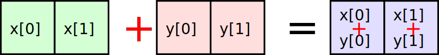
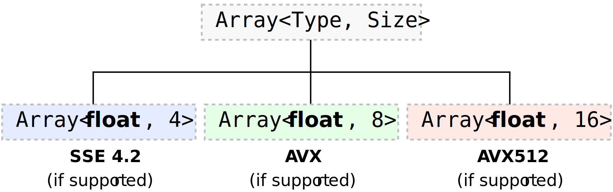
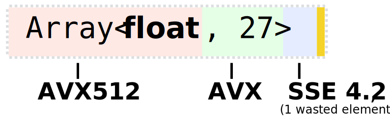
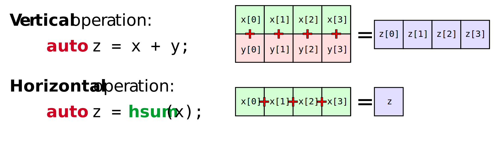

.. cpp:namespace:: enoki

Basics
======

The remainder of this document provides a basic overview of the Enoki library.
All code snippets assume that the following lines are present:

.. code-block:: cpp

    #include <iostream>
    #include <enoki/array.h>

    /* Don't forget to include the 'enoki' namespace */
    using namespace enoki;

.. note::

    The next few sections will introduce the basics of Enoki in the context of
    vectorization for CPUs. Later sections will discuss vectorization via
    :ref:`GPU arrays <gpu>` and :ref:`Automatic differentiation <autodiff>`. It
    is recommended that you read the following sections even if you are mainly
    interested in the latter two topics.

Static arrays
-------------

The most important data structure in this library is :cpp:class:`enoki::Array`,
a generic container that stores a fixed-size array of an arbitrary data type.
This is somewhat similar to the standard template library class ``std::array``.
The main distinction between the two is that :cpp:class:`enoki::Array` forwards
all C++ operators (and other standard mathematical functions) to the contained
elements.

For instance, the snippet

.. code-block:: cpp

    using StrArray = Array<std::string, 2>;

    StrArray x("Hello ", "How are "),
             y("world!", "you?");

    // Prints: "[Hello world!,  How are you?]"
    std::cout << x + y << std::endl;

is valid because ``Array::operator+()`` can carry out the addition by invoking
``std::string::operator+()`` (this would not compile if ``std::array`` was used,
since it has no such semantics).

Enoki arrays also have support for a convenient feature that is commonly known
as *broadcasting*---in this simple example, broadcasting is triggered if we add
a raw string corresponding to an array of dimension zero. Fancier applications
of broadcasting are discussed later.

.. code-block:: cpp

    // Prints: "[Hello you,  How are you]"
    std::cout << x + "you" << std::endl;

The real use case of Enoki arrays, however, involves arrays of integer
or floating point values, for which arithmetic operations can often be reduced
to fast vectorized instructions provided by current processor architectures.

The library ships with partial template overloads that become active when the
``Type`` and ``Size`` parameters supplied to the ``enoki::Array<Type, Size>``
template correspond to combinations that are natively supported by the targeted
hardware. For instance, the template overloads for single precision arrays look
as follows:

Altogether, Enoki currently currently supports the ARM NEON, SSE4.2, AVX, AVX2,
and AVX512 instruction sets and vectorizes arithmetic involving single and
double precision floating point values as well as signed and unsigned 32-bit
and 64-bit integers.

It is worth pointing out that that :cpp:class:`enoki::Array` does *not* require
``Size`` to exactly match what is supported by the hardware to benefit from
vectorization. Enoki relies on template metaprogramming techniques to ensure
optimal code generation even in such challenging situations. For instance,
arithmetic operations involving a hypothetical ``Array<float, 27>`` type will
generate one AVX512 instruction [#f1]_, one AVX instruction, and one 4-wide SSE
instruction that leaves the last entry unused.

A perhaps more sensible use of this feature is to instantiate packed arrays
with a ``Size`` that is an integer multiple of what is supported natively as a
way of aggressively unrolling the underlying computations.

In addition to ``Type`` and ``Size``, :cpp:class:`enoki::Array` supports two
additional template parameters.  We will explicitly specify them all below to
define a new type named ``MyFloat``:

.. code-block:: cpp

    using MyFloat = Array<
        float,                 // Type:   Underlying scalar data type
        4,                     // Size:   Number of packed float elements
        true,                  // Approx: Use approximate math library?
        RoundingMode::Default  // Mode:   Rounding mode (Default/Up/Down/Zero/Nearest)
    >;

Most of the parameters can be omitted: if ``Size`` is not specified, the
implementation chooses the largest value that is natively supported by the
target hardware. The ``Approx`` parameter specifies whether Enoki's vectorized
math library should be used for transcendental function evaluations such as
``exp()``, ``cos()``, as opposed to serializing those evaluations through the
standard C math library.

The vectorized math library is slightly more approximate, though this is
generally negligible (the average relative error is generally
:math:`<\!\frac{1}{2}` ULP on their full domain---see the :ref:`reference
<transcendental-accuracy>` for details. The default rounding mode
:any:`RoundingMode::Default` means that the library won't interfere with the
hardware's currently selected rounding mode. Note that the last two parameters
only make sense when dealing with floating point types.

Initializing, reading, and writing data
---------------------------------------

Arrays can be initialized by broadcasting a scalar value, or by specifying the
values of individual entries.

.. code-block:: cpp

    /* Initialize all entries with a constant */
    MyFloat f1(1.f);

    /* Initialize the entries individually */
    MyFloat f2(1.f, 2.f, 3.f, 4.f);

The ``enoki`` namespace also contains a large number of global functions that
create or manipulate Enoki arrays in various ways. One example is the
:cpp:func:`enoki::load()` function, which is the method of choice to
initialize an array with data that is currently stored in memory:

.. code-block:: cpp

    float *mem = /* ... pointer to floating point data ... */;
    MyFloat f3;

    /* Load entries of 'f3' from 'mem' */
    f3 = load<MyFloat>(mem);           /* if known that 'mem' is aligned */
    f3 = load_unaligned<MyFloat>(mem); /* otherwise */

Both :cpp:func:`enoki::load()` and :cpp:func:`enoki::load_unaligned()`  are
template functions that load an array of the specified type (``MyFloat`` in
this case) from a given address in memory. The first indicates that the memory
address is aligned to a multiple of ``alignof(MyFloat)``, which is equal to 16
bytes in this example. It is a good idea to align data and use aligned versions
of operations, since this reduces the number of cache lines that must be
accessed.

.. warning::

    Performing an aligned load from an unaligned memory address will cause a
    general protection fault that immediately terminates the application.

.. note::

    It is generally desirable to use high-level Enoki template functions like
    :cpp:func:`enoki::load()` whenever possible since they are designed to
    produce the most efficient instruction sequences for the specified target
    architecture. In this case, we could also have written

    .. code-block:: cpp

        f3 = MyFloat(mem[0], mem[1], mem[2], mem[3]);

    which is functionally equivalent---however, it is not guaranteed that the
    compiler will be able to exploit the equivalence to generate optimal code
    in this case.

An analogous pair of operations stores the contents of arrays in memory:

.. code-block:: cpp

    /* Store entries of 'f3' to 'mem' */
    store(mem, f3);                    /* if known that 'mem' is aligned */
    store_unaligned(mem, f3)           /* otherwise */

Note that :cpp:func:`load` and :cpp:func:`load_unaligned` require the target
type as a template parameter, while the stores do not, since it can be inferred
from the provided value.

Gather, scatter, and scatter-add operations are also supported using a similar pattern:

.. code-block:: cpp

    /* 32 and 64 bit integers are supported as indices for scatter/gather operations */
    Array<int, 4> idx(1, 2, 3, 4);

    /* Gather f3 from mem -- this is equivalent to
       setting f3[i] = mem[idx[i]] (i = 0, 1, ..) */
    f3 = gather<MyFloat>(mem, idx);

    /* Scatter f3 to mem -- this is equivalent to
       setting mem[idx[i]] = f3[i] (i = 0, 1, ..) */
    scatter(mem, f3, idx);

    /* Atomic scatter-add of f3 to mem -- this is equivalent to
       setting mem[idx[i]] += f3[i] (i = 0, 1, ..). The operation
       is atomic in the sense that it gives the correct results
       if 'idx' refers to the same index twice. */
    scatter_add(mem, f3, idx);

Finally, the following initialization methods also exist:

.. code-block:: cpp

    /* Efficient way to create an array of any type filled with zero entries */
    f1 = zero<MyFloat>();

    /* Initialize entries with index sequence 0, 1, 2, ... */
    f1 = arange<MyFloat>();

    /* Initialize entries with a linearly increasing sequence with endpoints 0 and 1 */
    f1 = linspace<MyFloat>(0.f, 1.f);

Element access
--------------

The components of ``Array`` can be accessed via ``operator[]``. If you find
yourself using this much, your code is likely not making good use of the vector
units.

.. code-block:: cpp

    f2[2] = 1.f;

Alternatively, the functions ``x()``, ``y()``, ``z()``, and ``w()`` can be used
to access the first four components. The following line is equivalent to the
one above.

.. code-block:: cpp

    f2.z() = 1.f;

Components of a vector can be efficiently reordered using the following syntax:

.. code-block:: cpp

    // f1: [0, 10, 20, 30]
    f2 = shuffle<0, 2, 1, 3>(f1);
    // f2: [0, 20, 10, 30]

Finally, Enoki provides an overloaded ``operator<<(std::ostream&, ...)`` stream
insertion operator to facilitate the inspection of array contents:

.. code-block:: cpp

    /* The line below prints: [1, 2, 3, 4] */
    std::cout << MyFloat(1.f, 2.f, 3.f, 4.f) << std::endl;

.. _vertical:

Vertical operations
-------------------

Enoki provides the following *vertical* operations. The word vertical implies
that they are independently applied to all array elements.

.. code-block:: cpp

    /* Basic arithmetic operations*/
    f1 *= (f2 + 1.f) / (f2 - 1.f);

    /* Basic math library functions */
    f2 = ceil(f1); f2 = floor(f1); f2 = round(f1); f2 = trunc(f1);
    f2 = abs(f1);  f2 = sqrt(f1); f2 = cbrt(f1); f2 = sign(f1);
    f2 = min(f1, f2); f2 = max(f1, f2);

    /* Fused multiply-add/subtract */
    f1 = fmadd(f1, f2, f3); /* f1 * f2 + f3 */
    f1 = fmsub(f1, f2, f3); /* f1 * f2 - f3 */
    f1 = fnmadd(f1, f2, f3); /* -f1 * f2 + f3 */
    f1 = fnmsub(f1, f2, f3); /* -f1 * f2 - f3 */

    /* Efficient reciprocal and reciprocal square root */
    f1 = rcp(f1); f1 = rsqrt(f1);

    /* Trigonometric and inverse trigonometric functions */
    f2 = sin(f1);   f2 = cos(f1);    f2 = tan(f1);
    f2 = csc(f1);   f2 = sec(f1);    f2 = cot(f1);
    f2 = asin(f1);  f2 = acos(f1);   f2 = atan(f2);
    f2 = atan2(f1, f2);
    auto [s, c] = sincos(f1);

    /* Hyperbolic and inverse hyperbolic functions */
    f2 = sinh(f1);  f2 = cosh(f1);  f2 = tanh(f1);
    f2 = csch(f1);  f2 = sech(f1);  f2 = coth(f1);
    f2 = asinh(f1); f2 = acosh(f1); f2 = atanh(f2);
    auto [sh, ch] = sincosh(f1);

    /* Exponential function, natural logarithm, power function */
    f2 = exp(f1);   f2 = log(f1);   f2 = pow(f1, f2);

    /* Exponent/mantissa manipulation */
    f1 = ldexp(f1, f2);
    auto [mant, exp] = frexp(f1);

    /* Special functions */
    f2 = erf(f1); f2 = erfinv(f1); f2 = erfi(f1);
    f2 = i0e(f1); f2 = dawson(f1);

    f1 = comp_ellint_1(f1);     f1 = ellint_1(f1, f2);
    f1 = comp_ellint_2(f1);     f1 = ellint_2(f1, f2);
    f1 = comp_ellint_2(f1, f2); f1 = ellint_3(f1, f2, f3);

    /* Bit shifts and rotations (only for integer arrays) */
    i1 = sl<3>(i1);   i1 = sr<3>(i1);   /* Shift by a compile-time constant ("immediate") */
    i1 = i1 >> i2;    i1 = i1 << i2;    /* Element-wise shift by a variable amount */
    i1 = rol<3>(i1);  i1 = ror<3>(i1);  /* Rotate by a compile-time constant ("immediate") */
    i1 = rol(i1, i2); i1 = ror(i1, i2); /* Element-wise rotation by a variable amount */

    /* Trailing/leading zero count, population count (only for integer arrays) */
    i1 = lzcnt(i1);  i1 = tzcnt(i1);  i1 = popcnt(i1);

Casting
*******

A cast is another type of vertical operation. Enoki performs efficient
conversion between any pair of types using native conversion instructions
whenever possible:

.. code-block:: cpp

    using Source = Array<int64_t, 32>;
    using Target = Array<double, 32>;

    Source source = ...;
    Target target(source);

.. _horizontal:

Horizontal operations
---------------------

In contrast to the above vertical operations, the following *horizontal*
operations consider the entries of a packed array jointly and return a scalar.

Depending on the size of the array, these are implemented using between
:math:`log_2(N)` and :math:`N-1` vertical reduction operations and shuffles.
Horizontal operations should generally be avoided since they don't fully
utilize the hardware vector units (ways of avoiding them are discussed later).

.. code-block:: cpp

    /* Horizontal sum, equivalent to f1[0] + f1[1] + f1[2] + f1[3] */
    float s0 = hsum(f1);

    /* Horizontal product, equivalent to f1[0] * f1[1] * f1[2] * f1[3] */
    float s1 = hprod(f1);

    /* Horizontal minimum, equivalent to std::min({ f1[0], f1[1], f1[2], f1[3] }) */
    float s2 = hmin(f1);

    /* Horizontal maximum, equivalent to std::max({ f1[0], f1[1], f1[2], f1[3] }) */
    float s3 = hmax(f1);

    /* Horizontal mean , equivalent to (f1[0] + f1[1] + f1[2] + f1[3]) / 4.f */
    float s4 = hmean(f1);

The following linear algebra primitives are also realized in terms of horizontal operations:

.. code-block:: cpp

    /* Dot product of two arrays */
    float dp = dot(f1, f2);

    /* For convenience: absolute value of the dot product */
    float adp = abs_dot(f1, f2);

    /* Squared 2-norm of a vector */
    float sqn = squared_norm(f1);

    /* 2-norm of a vector */
    float nrm = norm(f1);

Working with masks
------------------

Comparisons involving Enoki types are generally applied component-wise and
produce a *mask* representing the outcome of the comparison. The internal
representation of a mask is an implementation detail that varies widely from
architecture to architecture -- an overview is given in the section
on :ref:`platform-differences`.

Masks enable powerful branchless logic in combination with a range of other
bit-level operations. The following snippets show some example usage of mask
types:

.. code-block:: cpp

    auto mask = f1 > 1.f;

    /* Bit-level AND operation: Zero out entries where the comparison was false */
    f1 &= mask;

Masks can be combined in various ways

.. code-block:: cpp

    mask ^= (f1 > cos(f2)) | ~(f2 <= f1);

The following range tests also generate masks

.. code-block:: cpp

    mask = isnan(f1);    /* Per-component NaN test */
    mask = isinf(f1);    /* Per-component +/- infinity test */
    mask = isfinite(f1); /* Per-component test for finite values */

.. note::

    Using the ``-ffast-math`` compiler option may break detection of NaN values, and
    so is typically not recommended.

Enoki provides a number of helpful trait classes to access array-related types.
For instance, :cpp:type:`enoki::mask_t` determines the mask type associated
with an array, which permits replacing the ``auto`` statement above.

.. code-block:: cpp

    using FloatMask = mask_t<MyFloat>;
    FloatMask mask = f1 > 1.f;

A comprehensive list of type traits is available in the :ref:`reference
<type-traits>`. Similar to the horizontal operations for addition and
multiplication involving arithmetic arrays, mask arrays also provide a set of
horizontal operations:

.. code-block:: cpp

    /* Do *all* entries have a mask value corresponding to 'true'? */
    bool mask_all_true  = all(mask);

    /* Do *some* entries have a mask value corresponding to 'true'? */
    bool mask_some_true = any(mask);

    /* Do *none* of the entries have a mask value corresponding to 'true'? */
    bool mask_none_true = none(mask);

    /* Count *how many* entries have a mask value corresponding to 'true'? */
    size_t true_count = count(mask);

.. note::

    *The special case of the equality and inequality comparison operators*:
    following the principle of least surprise, :cpp:func:`enoki::operator==`
    and :cpp:func:`enoki::operator!=` return a boolean value (i.e. they
    internally perform a horizontal reduction). *Vertical* comparison operators
    named :cpp:func:`eq` and :cpp:func:`neq()` are also available. The
    following pairs of operations are thus equivalent:

    .. code-block:: cpp

        MyFloat f1 = ..., f2 = ...;

        bool b1 = (f1 == f2);
        bool b2 = all(eq(f1, f2));

        bool b3 = (f1 != f2);
        bool b4 = any(neq(f1, f2));

One of the most useful bit-level operation is ``select()`` which chooses
between two arguments using a mask.  This is extremely useful for writing
branch-free code.  Argument order matches the C ternary operator, i.e.
``condition ? true_value : false_value`` maps to ``select(condition,
true_value, false_value)``.

.. code-block:: cpp

    f1 = select(f1 < 0.f, f1, f2);

    /* The above select() statement is equivalent to the following less efficient expression */
    f1 = ((f1 < 0.f) & f1) | (~(f1 < 0.f) & f2);

Enoki also provides a special masked assignment operator, which updates entries
of an array matching the given mask:

.. code-block:: cpp

    f1[f1 > 0.f] = f2;
    f1[f1 < 0.f] += 1.f;

Compared to ``select()``, a masked update may generate slightly more efficient
code on some platforms. Apart from this, the two approaches can be used
interchangeably. An alternative syntax involving the function
:cpp:func:`enoki::masked` also exists:

.. code-block:: cpp

    masked(f1, f1 > 0.f) = f2;
    masked(f1, f1 < 0.f) += 1.f;

This is functionally equivalent to the previous example. The
:cpp:func:`enoki::masked` syntax exists because it extends to cases where
``f1`` is *scalar*, i.e. not an Enoki array. Using Enoki functions with scalar
arguments will be discussed later.

.. _3d-arrays:

The special case of 3D arrays
-----------------------------

Because information of dimension 3 occurs frequently (spatial coordinates,
color information, ...) and generally also benefits very slightly from
vectorization, Enoki represents 3-vectors in packed arrays of size 4, leaving
the last component unused. Any vertical operations are applied to the entire
array including the fourth component, while horizontal operations skip the
last component.

An efficient cross product operation realized using shuffles is available for
3-vectors:

.. code-block:: cpp

    f1 = cross(f1, f2);

Generally, a better way to work with 3D data while achieving much greater
instruction level parallelism is via nested arrays and the *Structure of
Arrays* (SoA) approach discussed next.

.. rubric:: Footnotes

.. [#f1] Different combinations are used when not all of these instruction
         sets are available.

