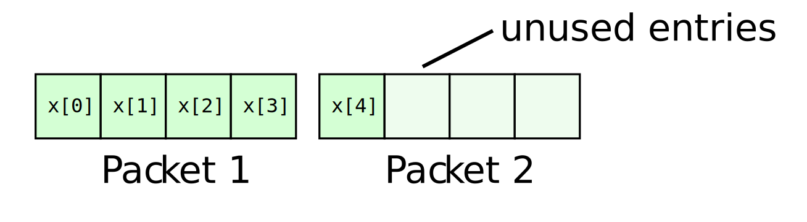
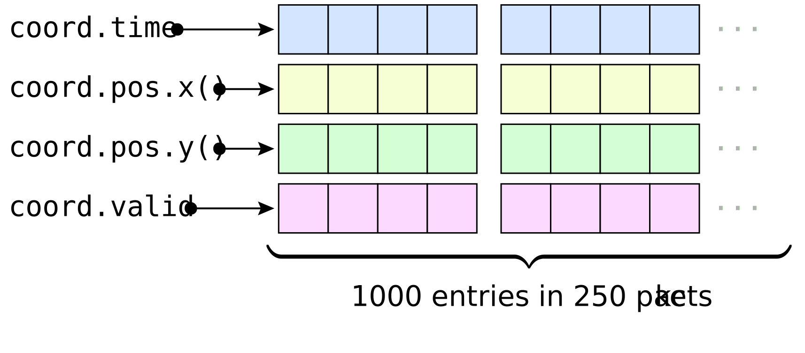
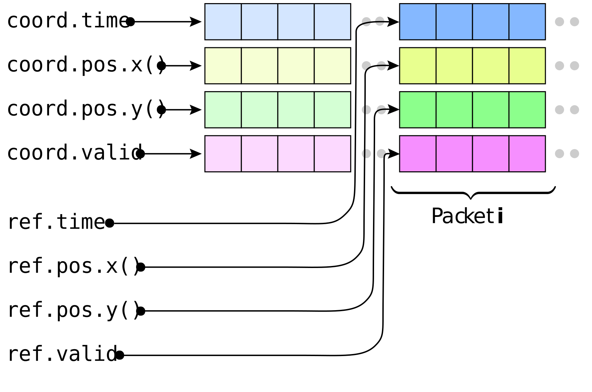
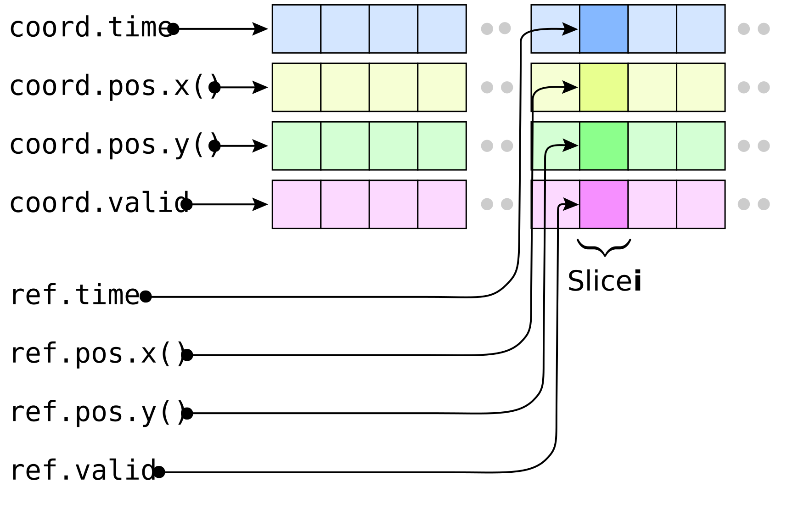
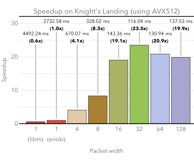
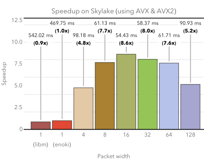

.. _dynamic:

Dynamic CPU arrays
==================

Arrays and nested arrays facilitate the development of vectorized code that
processes multiple values at once. However, it can be awkward to work with
small fixed packet sizes when the underlying application must process millions
or billions of data points. The remainder of this document discusses
infrastructure that can be used to realize computations on the CPU involving
dynamically allocated arrays of arbitrary length.

One of the core ingredients is :cpp:class:`enoki::DynamicArray`, which is a
smart pointer that manages the lifetime of a dynamically allocated memory
region. It is the exclusive owner of this data and is also responsible for its
destruction when the dynamic array goes out of scope (similar to
``std::unique_ptr``). Dynamic arrays can be used to realize arithmetic
involving data that is much larger than the maximum SIMD width supported by the
underlying hardware.

Note that its implementation is contained in a separate header file that must be included:

.. code-block:: cpp

    #include <enoki/dynamic.h>

The class requires a single template argument, which can be any kind of
:cpp:class:`enoki::Array`. This is the *packet type* that will be used to used
to realize vectorized computations involving the array contents. The following
code snippet illustrates the creation of a dynamic floating point array that
vectorizes using 4-wide SSE arithmetic.

.. code-block:: cpp

    /* Static float array (the suffix "P" indicates that this is a fixed-size packet) */
    using FloatP = Packet<float, 4>;

    /* Dynamic float array (vectorized via FloatP, the suffix "X" indicates arbitrary length) */
    using FloatX = DynamicArray<FloatP>;

.. note::

    In contrast to all array types discussed so far, a
    :cpp:class:`enoki::DynamicArray` instance *should not* be part of an
    arithmetic expression. For instance, the following will compile and yield
    the expected result, but this style of using dynamic arrays is disouraged.

    .. code-block:: cpp
        :emphasize-lines: 4

        FloatX in1 = ... , in2 = ... , in3 = ... , in4 = ...;

        /* Add the dynamic arrays using operator+() */
        FloatX out = in1 + in2 + in3 + in4;

    Why that is the case requires a longer explanation on the design of this
    library.

    At a high level, there are two "standard" ways of implementing arithmetic
    for dynamically allocated memory regions.

    1. A common approach (used e.g. by most ``std::valarray`` implementations)
       is to evaluate partial expressions in place, creating a large number
       of temporaries in the process.

       This is unsatisfactory since the amount of computation is very small
       compared to the resulting memory traffic.

    2. The second is a technique named `expression templates
       <https://en.wikipedia.org/wiki/Expression_templates>`_ that is used
       in libraries such as `Eigen <https://eigen.tuxfamily.org>`_.
       Expression templates construct complex graphs describing the inputs
       and operations of a mathematical expression using C++ templates.
       The underlying motivation is to avoid numerous memory allocations
       for temporaries by postponing evaluation until the point where the
       expression template is assigned to a storage container.

       Unfortunately, pushed to the scale of entire programs, this approach
       tends to produce intermediate code with an extremely large number of
       common subexpressions that exceeds the capabilities of the *common
       subexpression elimination* (CSE) stage of current compilers. The
       first version of Enoki in fact used expression templates, and it was
       due to the difficulties with them that an alternative was developed.

    The key idea of vectorizing over dynamic Enoki arrays is to iterate over
    packets (i.e. static arrays) that represent a sliding window into the
    dynamic array's contents. Packets, in turn, are easily supported using the
    tools discussed in the previous sections. Enoki provides a powerful
    operation named :cpp:func:`enoki::vectorize`, discussed later, that
    implements this sliding window technique automatically.

    That said, for convenience, arithmetic operations like ``operator+`` *are*
    implemented for dynamic arrays, and they are realized using approach 1 of
    the above list (i.e. with copious amounts of memory allocation for
    temporaries). Using them in performance-critical code is unadvisable.

Allocating dynamic arrays
-------------------------

When allocating dynamic arrays, the underlying memory region is always fully
aligned according to the requirements of the packet type. Enoki may sometimes
allocate a partially used packet at the end, which eliminates the need for
special end-of-array handling. The following code snippet allocates an array of
size 5 using 4-wide packets, which means that 3 entries at the end are unused.

.. code-block:: cpp

    /* Creates a dynamic array that is initially empty */
    FloatX x;

    /* Allocate memory for at least 5 entries */
    set_slices(x, 5);

    /* Query the size (a.k.a number of "slices") of the dynamic array */
    size_t slice_count = slices(x);
    assert(slice_count == 5);

    /* Query the number of packets */
    size_t packet_count = packets(x);
    assert(packet_count == 2);

A few convenience initialization methods also exist:

.. code-block:: cpp

    /* Efficient way to create an array filled with zero entries */
    x = zero<FloatX>(size);

    /* .. or an unitialized array */
    x = empty<FloatX>(size);

    /* Initialize entries with index sequence 0, 1, 2, ... */
    x = arange<FloatX>(size);

    /* Initialize entries with a linearly increasing sequence with endpoints 0 and 1 */
    x = linspace<FloatX>(0.f, 1.f, size);

Custom dynamic data structures
------------------------------

The :ref:`previous section <custom-structures>` used the example of a GPS
record to show how Enoki can create packet versions of a type. The same
approach also generalizes to dynamic arrays, allowing an arbitrarily long
sequence of records to be represented. This requires two small additions to the
original type declaration:

.. code-block:: cpp
    :emphasize-lines: 10, 11, 14
    :linenos:

    template <typename Value> struct GPSCoord2 {
        using Vector2 = Array<Value, 2>;
        using UInt64  = uint64_array_t<Value>;
        using Bool    = bool_array_t<Value>;

        UInt64 time;
        Vector2 pos;
        Bool reliable;

        ENOKI_STRUCT(GPSCoord2,           /* <- name of this class */
                     time, pos, reliable  /* <- list of all attributes in layout order */)
    };

    ENOKI_STRUCT_SUPPORT(GPSCoord2, time, pos, reliable)

The two highlighted additions do the following:

1. The macro on lines 10 and 11 declares copy and assignment constructors that
   are able to convert between different types of records.

2. The macro on line 14 makes Enoki aware of ``GPSCoord2`` for the purposes of
   dynamic vectorization.

It is possible but fairly tedious to write these declarations by hand, hence
the code generation macros should generally be used.

With these declarations, we can now allocate a dynamic array of 1000
coordinates that will be processed in packets of 4 (or more, depending on the
definition of ``FloatP``):

.. code-block:: cpp

   using GPSCoord2fX = GPSCoord2<FloatX>;

   GPSCoord2fX coord;
   set_slices(coord, 1000);

In memory, this data will be arranged as follows:

In other words: each field references a dynamic array that contiguously stores
the contents in a SoA organization.

Accessing array packets
-----------------------

The :cpp:func:`enoki::packet` function can be used to create a reference to the
:math:`i`-th packet of a dynamic array or a custom dynamic data structure.
For instance, the following code iterates over all packets and resets their
time values:

.. code-block:: cpp

    /* Reset the time value of all records */
    for (size_t i = 0; i < packets(coord); ++i) {
        GPSRecord2<FloatP&> ref = packet(coord, i);
        ref.time = 0;
    }

The ``packet()`` function is interesting because it returns an instance of a
new type ``GPSRecord2<FloatP&>`` that was not discussed yet (note the ampersand
in the template argument). Instead of directly storing data, all fields of a
``GPSRecord2<FloatP&>`` are *references* pointing to packets of data elsewhere in
memory. In this case, assigning (writing) to a field of this structure of
references will change the corresponding entry of the dynamic array!
Conceptually, this looks as follows:

References can also be cast into their associated packet types and vice versa:

.. code-block:: cpp

    /* Read a GPSRecord2<FloatP&> and convert to GPSRecord2<FloatP> */
    GPSCoord2fP cp = packet(coord, i);

    /* Assign a GPSRecord2<FloatP> to a GPSRecord2<FloatP&> */
    packet(coord, i + 1) = cp;

.. note::

    For non-nested dynamic arrays such as ``FloatX = DynamicArray<FloatP>``,
    ``packet()`` simply returns a reference to the selected ``FloatP``
    entry in that array of packets. We generally encourage using universal
    references (``auto &&``) to hold the result of ``packet()`` so that both
    cases are handled in the same way:

    .. code-block:: cpp

        auto   ref = packet(coord, i);   // Only works for dynamic structures
        auto  &ref = packet(numbers, i); // Only works for non-nested arrays
        auto &&ref = packet(coord, i);   // Works for both

Accessing array slices
----------------------

Enoki provides a second way of indexing into dynamic arrays: the
:cpp:func:`enoki::slice` function creates a reference to the
:math:`i`-th *slice* of a dynamic array or a custom dynamic data
structure. Elements of a slice store references to *scalar*
elements representing a vertical slice through the data structure.

The following code iterates over all slices and initializes the time values to
an increasing sequence:

.. code-block:: cpp

    /* Set the i-th time value to 'i' */
    for (size_t i = 0; i < slices(coord); ++i) {
        auto ref = slice(coord, i);
        ref.time = i;
    }

Here, the :cpp:func:`enoki::slice()` function returns an instance
of a new type ``GPSRecord2<float&>`` (again, note the ampersand),
Conceptually, this looks as follows:

Slice reference types can also be cast into their associated scalar data types
and vice versa:

.. code-block:: cpp

    /* Read a GPSRecord2<float&> and convert to GPSRecord2<float> */
    GPSCoord2f c = slice(coord, n);

    /* Assign a GPSRecord2<float> to a GPSRecord2<float&> */
    slice(coord, n + 1) = c;

Dynamic vectorization
---------------------

Now suppose that we'd like to compute the pairwise distance between records
organized in two dynamically allocated lists. Direct application of the
discussed ingredients leads to the following overall structure:

.. code-block:: cpp

    GPSCoord2fX coord1;
    GPSCoord2fX coord2;
    FloatX result;

    // Allocate memory and fill input arrays with contents (e.g. using slice(...))
    ...

    // Call SIMD-vectorized function for each packet
    for (size_t i = 0; i < packets(coord1); ++i)
        packet(result, i) = distance(packet(coord1, i),
                                     packet(coord2, i));

This does not quite compile (yet)---a minor modification of the ``distance()``
function is required:

.. code-block:: cpp
    :emphasize-lines: 2, 3
    :linenos:

    /// Calculate the distance in kilometers between 'r1' and 'r2' using the haversine formula
    template <typename Value_, typename Value = expr_t<Value_>>
    Value distance(const GPSCoord2<Value_> &r1, const GPSCoord2<Value_> &r2) {
        using Scalar = scalar_t<Value>;
        const Value deg_to_rad = Scalar(M_PI / 180.0);

        auto sin_diff_h = sin(deg_to_rad * .5f * (r2.pos - r1.pos));
        sin_diff_h *= sin_diff_h;

        Value a = sin_diff_h.x() + sin_diff_h.y() *
                  cos(r1.pos.x() * deg_to_rad) *
                  cos(r2.pos.x() * deg_to_rad);

        return select(
            r1.reliable & r2.reliable,
            Scalar(6371.f * 2.f) * atan2(sqrt(a), sqrt(1.f - a)),
            std::numeric_limits<Scalar>::quiet_NaN()
        );
    }

The modified version above uses the :cpp:type:`enoki::expr_t` type trait to
determine a suitable type that is able to hold the result of an expression
involving its argument (which turns ``FloatP&`` into ``FloatP`` in this case).

.. note::

    The issue with the original code was that it was called with a
    ``GPSRecord2<FloatP&>`` instance, i.e. with a template parameter ``Value =
    FloatP&``. However, the ``Value`` type is also used for the return value as
    well as various intermediate computations, which is illegal since these
    temporaries are not associated with an address in memory.

With these modifications, we are now finally able to vectorize over the dynamic
array:

.. code-block:: cpp

    // Call SIMD-vectorized function for each packet -- yay!
    for (size_t i = 0; i < packets(coord1); ++i)
        packet(result, i) = distance(packet(coord1, i),
                                     packet(coord2, i));

Shorthand notation
------------------

Extracting individual packets as shown in the snippet above can become fairly
tedious when a function takes many arguments. Enoki offers a convenient helper
function named :cpp:func:`enoki::vectorize` that automates this process. It
takes a function and a number of dynamic arrays as input and calls the function
once for each set of input packets.

.. code-block:: cpp

    FloatX result = vectorize(
        distance<FloatP>, // Function to call
        coord1,           // Input argument 1
        coord2            // Input argument 2
                          // ...
    );

Here, the returned float packets are stored in a dynamic array of type
``FloatX``.

When the output array is already allocated, it is also possible to write the
results directly into the array. The snippet below shows how to do this by
calling call :cpp:func:`enoki::vectorize` with a lambda function.

.. code-block:: cpp

    vectorize(
         {
            result = distance<FloatP>(coord1, coord2);
        },
        result,
        coord1,
        coord2
    );

Note the use of a variadic lambda with ``auto&&`` arguments: it would be
redundant to specify the argument types since they are automatically inferred
from the function inputs.

Naturally, we could also perform the complete calculation within the lambda function:

.. code-block:: cpp

    vectorize(
         {
            using Value = FloatP;
            using Scalar = float;

            const Value deg_to_rad = Scalar(M_PI / 180.0);

            auto sin_diff_h = sin(deg_to_rad * .5f * (coord2.pos - coord1.pos));
            sin_diff_h *= sin_diff_h;

            Value a = sin_diff_h.x() + sin_diff_h.y() *
                      cos(coord1.pos.x() * deg_to_rad) *
                      cos(coord2.pos.x() * deg_to_rad);

            result = select(
                coord1.reliable & coord2.reliable,
                (6371.f * 2.f) * atan2(sqrt(a), sqrt(1.f - a)),
                std::numeric_limits<Scalar>::quiet_NaN()
            );
        },

        result,
        coord1,
        coord2
    );

It is not necessary to "route" all parameters through
:cpp:func:`enoki::vectorize`. Auxiliary data structures or constants are easily
accessible via the lambda capture object using the standard ``[&]`` notation.

A benchmark
-----------

We now turn to the results of a microbenchmark which runs the previously
discussed GPS record distance function on a dynamic array with 10 million
entries.

.. container:: toggle

    .. container:: header

        **Show/Hide Code**

    .. code-block:: cpp
       :linenos:

        /* Compilation flags:
           $ clang++ benchmark.cpp -o benchmark -std=c++14 -I include -O3
                     -march=native -fomit-frame-pointer -fno-stack-protector -DNDEBUG
         */

        #include <enoki/array.h>
        #include <enoki/random.h>
        #include <chrono>

        using namespace enoki;

        auto clk() { return std::chrono::high_resolution_clock::now(); }

        template <typename T> float clkdiff(T a, T b) {
            return std::chrono::duration<float>(b - a).count() * 1000;
        }

        template <typename Value> struct GPSCoord2 {
            using Vector2 = Array<Value, 2>;
            using UInt64  = uint64_array_t<Value>;
            using Bool    = mask_t<Value>;

            UInt64 time;
            Vector2 pos;
            Bool reliable;

            ENOKI_STRUCT(GPSCoord2, time, pos, reliable)
        };

        ENOKI_STRUCT_SUPPORT(GPSCoord2, time, pos, reliable)

        using FloatP       = Packet<float, SIMD_WIDTH>;
        using FloatX       = DynamicArray<FloatP>;
        using GPSCoord2fX  = GPSCoord2<FloatX>;
        using GPSCoord2fP  = GPSCoord2<FloatP>;
        using GPSCoord2f   = GPSCoord2<float>;

        using RNG = PCG32<FloatP>;

        /// Calculate the distance in kilometers between 'r1' and 'r2' using the haversine formula
        template <typename Value_, typename Value = expr_t<Value_>>
        ENOKI_INLINE Value distance(const GPSCoord2<Value_> &r1, const GPSCoord2<Value_> &r2) {
            using Scalar = scalar_t<Value>;

            const Value deg_to_rad = Scalar(M_PI / 180.0);

            auto sin_diff_h = sin(deg_to_rad * .5f * (r2.pos - r1.pos));
            sin_diff_h *= sin_diff_h;

            Value a = sin_diff_h.x() + sin_diff_h.y() *
                      cos(r1.pos.x() * deg_to_rad) *
                      cos(r2.pos.x() * deg_to_rad);

            return select(
                r1.reliable & r2.reliable,
                (6371.f * 2.f) * atan2(sqrt(a), sqrt(1.f - a)),
                Value(std::numeric_limits<Scalar>::quiet_NaN())
            );
        }

        int main(int argc, char *argv[]) {
            for (int i =0; i<3; ++i) {
                GPSCoord2fX coord1;
                GPSCoord2fX coord2;
                FloatX result;

                auto clk0 = clk();

                size_t size = 10000000;
                set_slices(coord1, size);
                set_slices(coord2, size);
                set_slices(result, size);

                auto clk1 = clk();

                RNG rng;

                for (size_t j = 0; j < packets(coord1); ++j) {
                    packet(coord1, j) = GPSCoord2fP {
                        0,
                        { rng.next_float32() * 180.f - 90, rng.next_float32() * 360.f - 180.f},
                        true
                    };
                    packet(coord2, j) = GPSCoord2fP {
                        0,
                        { rng.next_float32() * 180.f - 90, rng.next_float32() * 360.f - 180.f},
                        true
                    };
                }

                auto clk2 = clk();

                vectorize( {
                              result = distance<FloatP>(coord1, coord2);
                          },
                          result, coord1, coord2);

                auto clk3 = clk();
                std::cout << clkdiff(clk2, clk3) << " (alloc = " << clkdiff(clk0, clk1)
                          << ", fill = " << clkdiff(clk1, clk2) << ")" << std::endl;
            }

            return 0;
        }

The plots show the measured speedup relative to a scalar baseline
implementation. We consider two different microarchitectures:

Knight's Landing microarchitecture (Xeon Phi 7210)
++++++++++++++++++++++++++++++++++++++++++++++++++

The Knight's Landing architecture provides hardware support for SIMD arithmetic
using 16 single precision point values. Interestingly, the best performance is
reached when working with arrays of 32 entries, which can be interpreted as a
type of loop unrolling. The ability of issuing wide memory operations,
performing branchless arithmetic using vector registers, and keeping two
independent instructions in flight for each arithmetic operation leads to a
total speedup of 23.5x (i.e. considerably exceeding the expected maximum
speedup of 16 from the vectorized instructions alone!).

Relative to the C math library, Enoki obtains an even larger speedup of
**38.7x**. Using the standard C math library on this platform is fairly
expensive, presumably because of function call penalties on Xeon Phi (Enoki
generally inlines functions), and because it is compiled for a generic x86_64
machine rather than the native architecture.

*Platform details*: clang trunk rev. 304711 on Linux 64 bit (RHEL 7.3)

Skylake microarchitecture (i7-6920HQ)
+++++++++++++++++++++++++++++++++++++

The Skylake architecture provides hardware support for SIMD arithmetic using 8
single precision point values. Significant speedups are observed for packets of
8 and 16 entries. It is likely that more involved functions (i.e. with a higher
register pressure) will have a sharper performance drop after :math:`n=16` due
to the relatively small number of registers on this platform. Enoki
single-precision transcendentals are only slightly faster than the standard C math
library on this platform. The max. speedup relative to the standard C math
library is **10.0x**.

*Platform details*: clang trunk rev. 304711 on macOS 10.12.5

