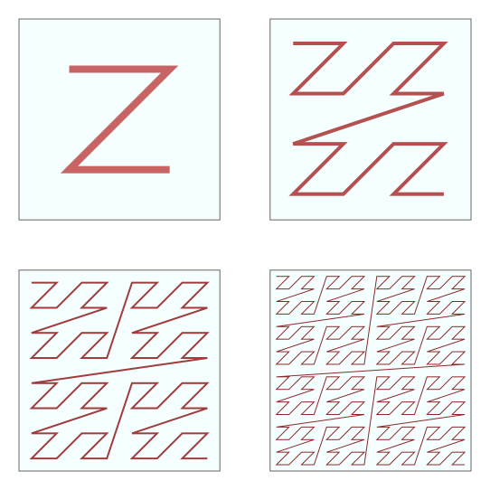

.. cpp:namespace:: enoki

Morton/Z-order indexing
=======================

Enoki provides efficient support for encoding and decoding of Morton/Z-order
indices of arbitrary dimension. Both scalar indices and index vectors are
supported. Z-order indexing can improve the locality accesses when two- or
higher-dimensional data is arranged in memory.

    (Figure by `David Eppstein <https://commons.wikimedia.org/wiki/File:Four-level_Z.svg>`_)

To use this feature, include the following header:

.. code-block:: cpp

    #include <enoki/morton.h>

Usage
-----

The following shows a round trip, encoding a 32-bit position as a Morton index
and decoding it again.

.. code-block:: cpp

    using Vector2u = Array<uint32_t, 2>;

    Vector2u pos(123u, 456u);
    uint32_t encoded = morton_encode(pos);
    Vector2u decoded = morton_decode<Vector2u>(encoded);

    std::cout << "Original : " << pos << std::endl;
    std::cout << "Encoded  : " << encoded << std::endl;
    std::cout << "Decoded  : " << decoded << std::endl;

    /* Prints:
        Original : [123, 456]
        Encoded  : 177605
        Decoded  : [123, 456]
    */

Depending on hardware support, Enoki implements these operations using BMI2
instructions or bit shifts with precomputed magic constants.

The same also works for nested vectors:

.. code-block:: cpp

    using UInt32P = Packet<uint32_t, 8>;
    using Vector2uP = Array<UInt32P, 2>;

    Vector2uP pos(123u, 456u);
    UInt32P encoded = morton_encode(pos);
    Vector2uP decoded = morton_decode<Vector2uP>(encoded);

    std::cout << "Original : " << pos << std::endl;
    std::cout << "Encoded  : " << encoded << std::endl;
    std::cout << "Decoded  : " << decoded << std::endl;

    /* Prints:
        Original : [[123, 456], [123, 456], [123, 456], [123, 456], [123, 456], [123, 456], [123, 456], [123, 456]]
        Encoded  : [177605, 177605, 177605, 177605, 177605, 177605, 177605, 177605]
        Decoded  : [[123, 456], [123, 456], [123, 456], [123, 456], [123, 456], [123, 456], [123, 456], [123, 456]]
    */

Reference
---------

.. cpp:function:: template <typename Array> value_t<Array> morton_encode(Array array)

    Converts a potentially nested N-dimensional array into its corresponding
    Morton/Z-order index by interleaving the bits of the component values. The
    array must have an unsigned integer as its underlying scalar type.

.. cpp:function:: template <typename Array> Array morton_encode(value_t<Array> array)

    Converts a Morton/Z-order index or index array into a potentially nested
    N-dimensional array. The array must have an unsigned integer as its
    underlying scalar type.
