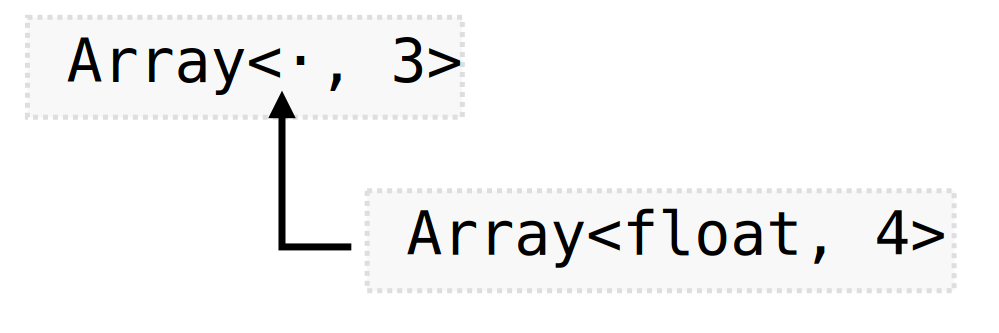
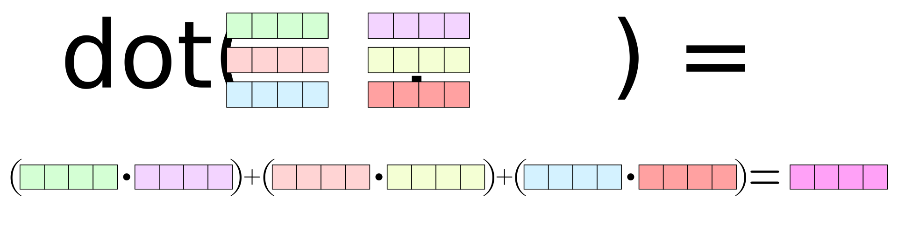
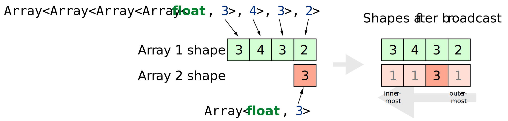
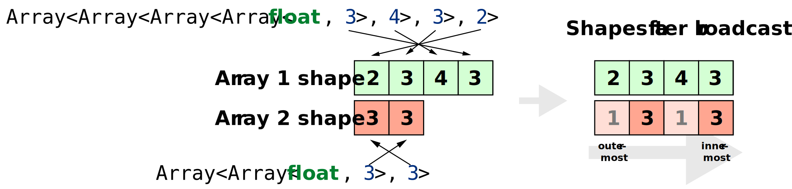
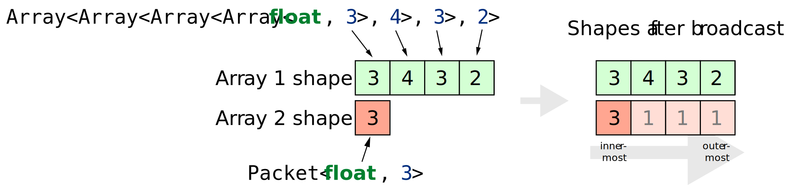

Nested arrays
=============

Motivation
----------

Application data is often not arranged in a way that is conductive to
efficient vectorization. For instance, vectors in a 3D dataset have too few
dimensions to fully utilize the SIMD lanes of modern hardware. Scalar or
horizontal operations like dot products lead to similar inefficiencies if
used frequently. In such situations, it is preferable to use *nested* arrays
using a technique that is known as a *Structure of Arrays* (SoA)
representation, which provides a way of converting scalar, horizontal, and
low-dimensional vector arithmetic into vertical operations that fully
utilize all SIMD lanes.

To understand the fundamental problem, consider the following basic example
code, which computes the normalized cross product of a pair of 3D vectors.
Without Enoki, this might be done as follows:

.. code-block:: cpp

    struct Vector3f {
       float x;
       float y;
       float z;
    };

   Vector3f normalize(const Vector3f &v) {
       float scale = 1.0f / std::sqrt(v.x*v.x + v.y*v.y + v.z*v.z);
       return Vector3f{v.x * scale, v.y * scale, v.z * scale};
   }

   Vector3f cross(const Vector3f &v1, const Vector3f &v2) {
       return Vector3f{
           (v1.y * v2.z) - (v1.z * v2.y),
           (v1.z * v2.x) - (v1.x * v2.z),
           (v1.x * v2.y) - (v1.y * v2.x)
       };
   }

    Vector3f normalized_cross(Vector3f a, Vector3f b) {
        return normalize(cross(a, b));
    }

Clang compiles the ``normalized_cross()`` function into the following fairly decent scalar
assembly (``clang -O3 -msse4.2 -mfma -ffp-contract=fast -fomit-frame-pointer``):

.. code-block:: nasm

    __Z16normalized_cross8Vector3fS_:
            vmovshdup   xmm4, xmm0           ; xmm4 = xmm0[1, 1, 3, 3]
            vmovshdup   xmm5, xmm2           ; xmm5 = xmm2[1, 1, 3, 3]
            vinsertps   xmm6, xmm3, xmm1, 16 ; xmm6 = xmm3[0], xmm1[0], xmm3[2, 3]
            vblendps    xmm7, xmm2, xmm0, 2  ; xmm7 = xmm2[0], xmm0[1], xmm2[2, 3]
            vpermilps   xmm7, xmm7, 225      ; xmm7 = xmm7[1, 0, 2, 3]
            vinsertps   xmm1, xmm1, xmm3, 16 ; xmm1 = xmm1[0], xmm3[0], xmm1[2, 3]
            vblendps    xmm3, xmm0, xmm2, 2  ; xmm3 = xmm0[0], xmm2[1], xmm0[2, 3]
            vpermilps   xmm3, xmm3, 225      ; xmm3 = xmm3[1, 0, 2, 3]
            vmulps      xmm1, xmm1, xmm3
            vfmsub231ps xmm1, xmm6, xmm7
            vmulss      xmm2, xmm4, xmm2
            vfmsub231ss xmm2, xmm0, xmm5
            vmovshdup   xmm0, xmm1           ; xmm0 = xmm1[1, 1, 3, 3]
            vmulss      xmm0, xmm0, xmm0
            vfmadd231ss xmm0, xmm1, xmm1
            vfmadd231ss xmm0, xmm2, xmm2
            vsqrtss     xmm0, xmm0, xmm0
            vmovss      xmm3, dword ptr [rip + LCPI0_0] ; xmm3 = 1.f, 0.f, 0.f, 0.f
            vdivss      xmm3, xmm3, xmm0
            vmovsldup   xmm0, xmm3           ; xmm0 = xmm3[0, 0, 2, 2]
            vmulps      xmm0, xmm1, xmm0
            vmulss      xmm1, xmm2, xmm3
            ret

However, note that only 50% of the above 22 instruction perform actual
arithmetic (which is scalar, i.e. low throughput), with the remainder being
spent on unpacking and re-shuffling data.

A first attempt
---------------

Simply rewriting this code using Enoki leads to considerable improvements:

.. code-block:: cpp

    /* Enoki version */
    using Vector3f = Array<float, 3>;

    Vector3f normalized_cross(Vector3f a, Vector3f b) {
        return normalize(cross(a, b));
    }

.. code-block:: nasm

    ; Assembly for Enoki version
    __Z16normalized_cross8Vector3fS_:
        vpermilps   xmm2, xmm0, 201 ; xmm2 = xmm0[1, 2, 0, 3]
        vpermilps   xmm3, xmm1, 210 ; xmm3 = xmm1[2, 0, 1, 3]
        vpermilps   xmm0, xmm0, 210 ; xmm0 = xmm0[2, 0, 1, 3]
        vpermilps   xmm1, xmm1, 201 ; xmm1 = xmm1[1, 2, 0, 3]
        vmulps      xmm0, xmm0, xmm1
        vfmsub231ps xmm0, xmm2, xmm3
        vdpps       xmm1, xmm0, xmm0, 113
        vsqrtss     xmm1, xmm1, xmm1
        vmovss      xmm2, dword ptr [rip + LCPI0_0] ; xmm2 = 1.f, 0.f, 0.f, 0.f
        vdivss      xmm1, xmm2, xmm1
        vpermilps   xmm1, xmm1, 0   ; xmm1 = xmm1[0, 0, 0, 0]
        vmulps      xmm0, xmm0, xmm1
        ret

Here, Enoki has organized the 3D vectors as :ref:`4D arrays that "waste" the
last component <3d-arrays>`, allowing for more compact sequence of SSE4.2
instructions with fewer shuffles. This is better but still not ideal: of the 12
instructions (a reduction by 50% compared to the previous example), 3 are
vectorized, 2 are scalar, and 1 is a (slow) horizontal reduction. The remaining
6 are shuffle and move instructions.

A better solution
-----------------

The key idea that enables further vectorization of this code is to work on 3D
arrays, whose components are themselves arrays. This is known as SoA-style data
organization. One group of multiple 3D vectors represented in this way is
referred to as a *packet*.

Since Enoki arrays support arbitrary nesting, it's straightforward to wrap an
existing ``Array`` representing a packet of data into another array while
preserving the semantics of an 3-dimensional vector at the top level.

As before, all mathematical operations discussed so far are trivially supported
due to the fundamental behavior of an Enoki array: all operations are simply
forwarded to the contained entries (which are themselves arrays now: the
procedure continues recursively). The following snippet demonstrates the basic
usage of such an approach.

.. code-block:: cpp

    /* Declare an underlying packet type with 4 floats (let's try non-approximate math mode first) */
    using FloatP = Array<float, 4, /* Approx = */ false>;

    /* NEW: Packet of 3D vectors containing four separate directions */
    using Vector3fP = Array<FloatP, 3>;

    Vector3fP vec(
       FloatP(1, 2, 3, 4),    /* X components */
       FloatP(5, 6, 7, 8),    /* Y components */
       FloatP(9, 10, 11, 12)  /* Z components */
    );

    /* Enoki's stream insertion operator detects the recursive array and
       prints the contents as a list of 3D vectors
       "[[1, 5, 9],
         [2, 6, 10],
         [3, 7, 11],
         [4, 8, 12]]" */
    std::cout << vec << std::endl;

    /* Element access using operator[] and x()/y()/z()/w() now return size-4 packets.
       The statement below prints "[1, 2, 3, 4]" */
    std::cout << vec.x() << std::endl;

    /* Transcendental functions are applied to all (nested) components independently */
    Vector3fP vec2 = sin(vec);

The behavior of horizontal operations changes as well--for instance, the dot
product

.. code-block:: cpp

    FloatP dp = dot(vec, vec2);

now creates a size-4 packet of dot products: one for each pair of input 3D
vectors. This is simply a consequence of applying the definition of the dot
product to the components of the array (which are now arrays).

Note how this is a major performance improvement since relatively inefficient
horizontal operations have now turned into a series of vertical operations that
make better use of the processor's vector units.

With the above type aliases, the ``normalized_cross()`` function now looks as
follows:

.. code-block:: cpp

    Vector3fP normalized_cross(Vector3fP a, Vector3fP b) {
        return normalize(cross(a, b));
    }

Disregarding the loads and stores that are needed to fetch the operands and
write the results, this generates the following assembly:

.. code-block:: nasm

    ; Assembly for SoA-style version
    __Z16normalized_cross8Vector3fS_:
        vmulps       xmm6, xmm2, xmm4
        vfmsub231ps  xmm6, xmm1, xmm5
        vmulps       xmm5, xmm0, xmm5
        vfmsub213ps  xmm2, xmm3, xmm5
        vmulps       xmm1, xmm1, xmm3
        vfmsub231ps  xmm1, xmm0, xmm4
        vmulps       xmm0, xmm2, xmm2
        vfmadd231ps  xmm0, xmm6, xmm6
        vfmadd231ps  xmm0, xmm1, xmm1
        vsqrtps      xmm0, xmm0
        vbroadcastss xmm3, dword ptr [rip + LCPI0_0]
        vdivps       xmm0, xmm3, xmm0
        vmulps       xmm3, xmm6, xmm0
        vmulps       xmm2, xmm2, xmm0
        vmulps       xmm0, xmm1, xmm0

This is *much* better: 15 vectorized operations which process four vectors at
the same time, while fully utilizing the underlying SSE4.2 vector units. If
wider arithmetic is available, it's of course possible to process many more
vectors at the same time.

Enoki will also avoid costly high-latency operations like division and square
root if the user indicates that minor approximations are tolerable. The
following snippet demonstrates code generation on an ARMv8 NEON machine when
the ``Approx`` template argument is set to ``true`` in the above example. Note
the use of the ``frsqrte`` and ``frsqrts`` instructions for the reciprocal
square root.

.. code-block:: nasm

    ; Assembly for ARM NEON (armv8a) version
    __Z16normalized_cross8Vector3fS_:
        fmul    v6.4s, v2.4s, v3.4s
        fmul    v7.4s, v0.4s, v4.4s
        fmls    v6.4s, v0.4s, v5.4s
        fmul    v16.4s, v1.4s, v5.4s
        fmls    v7.4s, v1.4s, v3.4s
        fmul    v0.4s, v6.4s, v6.4s
        fmls    v16.4s, v2.4s, v4.4s
        fmla    v0.4s, v7.4s, v7.4s
        fmla    v0.4s, v16.4s, v16.4s
        frsqrte v1.4s, v0.4s
        fmul    v2.4s, v1.4s, v1.4s
        frsqrts v2.4s, v2.4s, v0.4s
        fmul    v1.4s, v1.4s, v2.4s
        fmul    v2.4s, v1.4s, v1.4s
        frsqrts v0.4s, v2.4s, v0.4s
        fmul    v2.4s, v1.4s, v0.4s
        fmul    v0.4s, v6.4s, v2.4s
        fmul    v1.4s, v7.4s, v2.4s
        fmul    v2.4s, v16.4s, v2.4s

Unrolling the computation further
---------------------------------

On current processor architectures, most floating point operations have a
latency of :math:`\sim4-6` clock cycles. This means that instructions depending
the preceding instruction's result will be generally stall for at least that
long.

To alleviate the effects of latency, it can be advantageous to use an integer
multiple of the system's SIMD width (e.g. :math:`2\times`). This leads to
longer instructions sequences with fewer interdependencies, which can improve
performance noticeably.

.. code-block:: cpp

    using FloatP = Array<float, 32>;

With the above type definition on an AVX512-capable machine, Enoki would e.g.
unroll every 32-wide operation into a pair of 16-wide instructions.

Nested horizontal operations
----------------------------

Horizontal operations (e.g. :cpp:func:`hsum`) perform a reduction across the
outermost dimension, which means that they return arrays instead of scalars
when given a nested array as input (the same is also true for horizontal mask
operations such as :cpp:func:`any`).

Sometimes this is not desirable, and Enoki thus also provides nested versions
all of horizontal operations that can be accessed via the ``_nested`` suffix.
These functions recursively apply horizontal reductions until the result ceases
to be an array. For instance, the following function ensures that no element of
a packet of 3-vectors contains a *Not-a-Number* floating point value.

.. code-block:: cpp

    bool check(const Vector3fP &x) {
        return none_nested(isnan(x));
    }

.. _broadcasting:

Broadcasting
------------

Enoki performs an automatic broadcast operation whenever a higher-dimensional
array is initialized from a lower-dimensional array, or when types of mixed
dimension occur in an arithmetic expression.

The figure below illustrates a broadcast of a 3D vector to a rank 4 tensor
during an arithmetic operation involving both (e.g. addition).

Enoki works its way through the shape descriptors of both arrays, moving from
right to left in the above figure (i.e. from the outermost to the innermost
nesting level). At each iteration, it checks if the current pair of shape
entries match -- if they do, the iteration advances to the next entry.
Otherwise, a broadcast is performed over that dimension, which is analogous to
inserting a ``1`` into the lower-dimensional array's shape. When the dimensions
of the lower-dimensional array are exhausted, Enoki appends further ones until
the dimensions match. In the above example, the array is thus copied to the
second dimension, with a broadcast taking place over the last and first two
dimensions.

Broadcasting nested types works in the same way. Here, the entries of a
:math:`3\times 3` array are copied to the first and third dimensions of the
output array:

Automatic broadcasting is convenient whenever a computation combines both
vectorized and non-vectorized data. For instance, it is legal to mix instances
of type ``Vector4f`` and ``Vector4fP``, defined below, in the same expression.

.. code-block:: cpp
    :emphasize-lines: 12

    /* Packet data type */
    using FloatP    = Array<float>;

    /* 4D vector and packets of 4D vectors */
    using Vector4f  = Array<float, 4>;
    using Vector4fP = Array<FloatP, 4>;

    Vector4   data1 = ..;
    Vector4fP data2 = ..;

    /* This is legal -- 'result' is of type Vector4fP */
    auto result = data1 + data;

.. warning::

    Broadcasting can sometimes lead to unexpected and undesirable behavior. The
    following section explains how this can be avoided.

.. _broadcasting-gotchas:

Gotchas related to broadcasting
*******************************

Consider the following innocuous piece of code using the ``Vector4fP`` type
defined earlier:

.. code-block:: cpp

    Vector4fP data = ...;
    data /= norm(data);

The intent of the second line is to normalize a packet of 4D vectors by
dividing each by its norm. Unfortunately, this is not always what happens...

Let's first look at the expected outcome: when the code is compiled for a
machine with AVX instructions, the return value of ``norm()`` is an 8-wide float
packet (``Array<float, 8>``). The subsequent ``operator/=`` call triggers a
broadcast to a shape of ``[8, 4]``, which replicates the array multiple times
(once for each 4D vector component).

However, when the application is compiled for a machine with SSE4.2
instructions, the return value of ``norm()`` becomes a 4-wide float packet, and
the broadcast to a shape of ``[4, 4]`` behaves differently: since the sizes of
both arrays match in the last dimension, the broadcasting rules specify that
the array contents should be replicated across the *first dimension*. This
leads to a nonsensical operation that divides the :math:`i`-th coordinate (of
all vectors) by the norm of the :math:`i`-th vector.

Enoki provides the ``enoki::Packet<...>`` type to resolve any such
platform-dependent ambiguities. It is identical to the ``enoki::Array<...>``
class except for its behavior in a broadcast: the rules for a packet operate in
the reverse direction---that is, Enoki tries to copy the packet to the leading
dimensions instead of the trailing ones if possible:

.. note::

    Generally, packet types such as ``FloatP`` should be defined using the
    ``enoki::Packet`` type to benefit from this behavior.

The difference in the broadcasting behavior is demonstrated below:

.. code-block:: cpp
    :emphasize-lines: 2

    /* Packet data type */
    using FloatP    = Packet<float, 4>;

    /* 4D vector and packets of 4D vectors */
    using Vector4f  = Array<float, 4>;
    using Vector4fP = Array<FloatP, 4>;

    auto v1 = Vector4fP(Vector4f(1, 2, 3, 4));
    /* v1 contains 4 identical vectors with value [1, 2, 3, 4]

        [1, 2, 3, 4]
        [1, 2, 3, 4]
        [1, 2, 3, 4]
        [1, 2, 3, 4]
    */

    auto v2 = Vector4fP(FloatP(1, 2, 3, 4));
    /* v2 contains 4 distinct vectors, which each have uniform component values

        [1, 1, 1, 1]
        [2, 2, 2, 2]
        [3, 3, 3, 3]
        [4, 4, 4, 4]
    */

    /* This operation now does the expected.. */
    Vector4fP data = ...;
    data /= norm(data);

The remainder of this document will therefore use instantiatiations of the
``Packet<..>`` template to define arithmetic types used for vectorization on CPUs.
